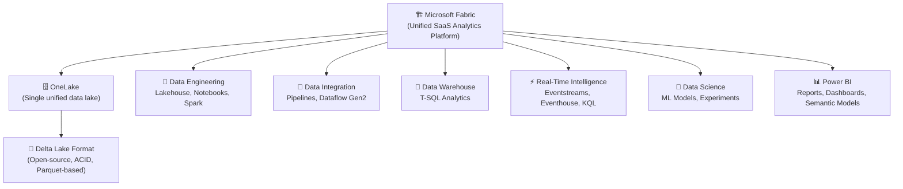
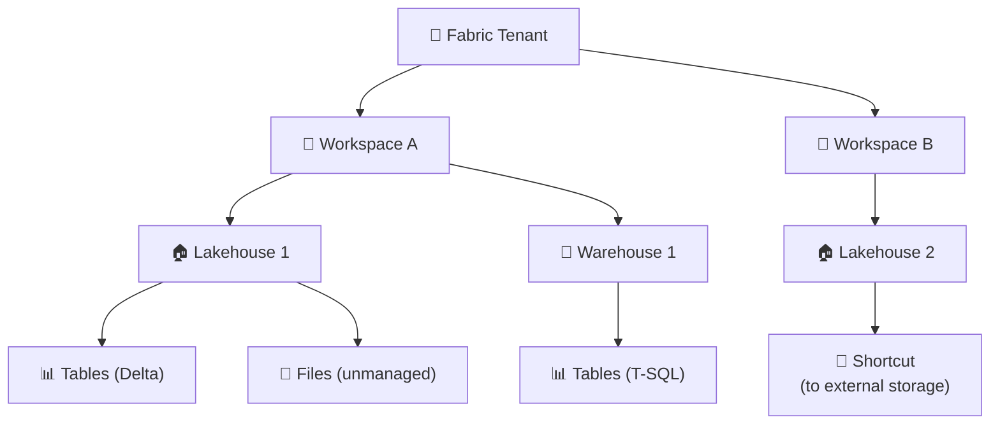
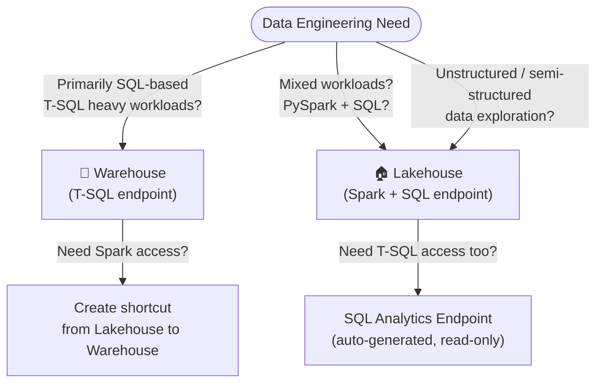
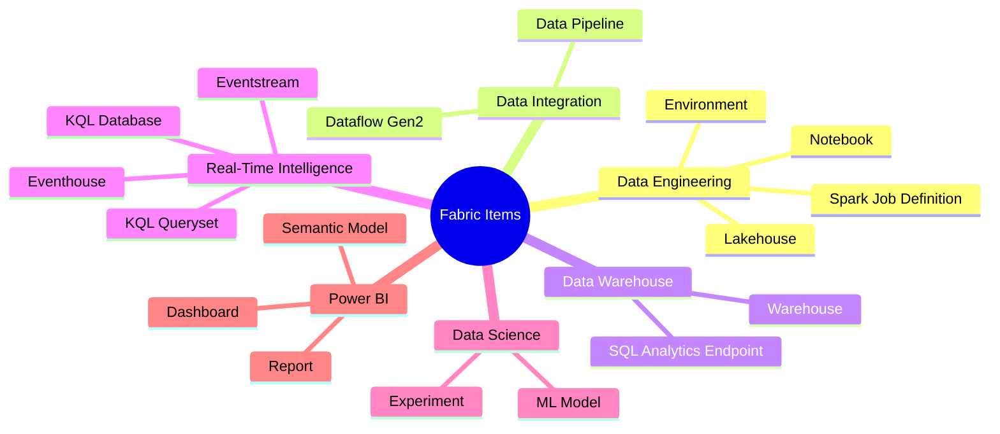
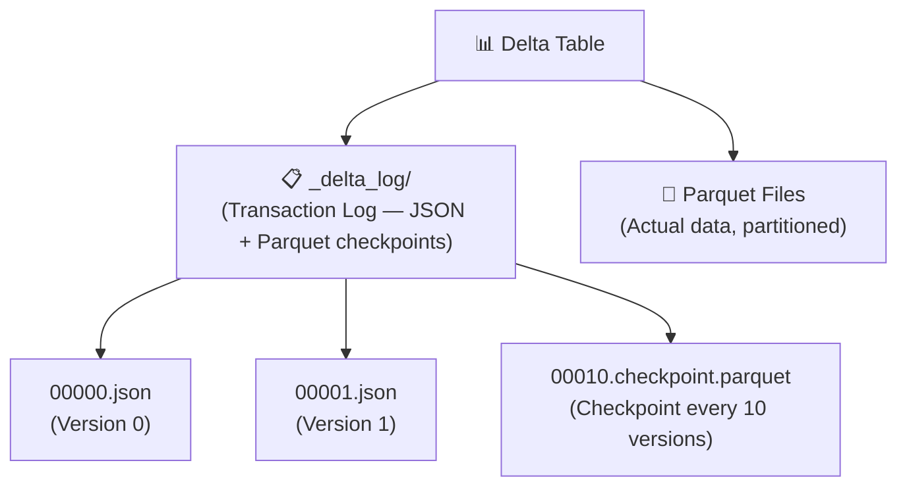
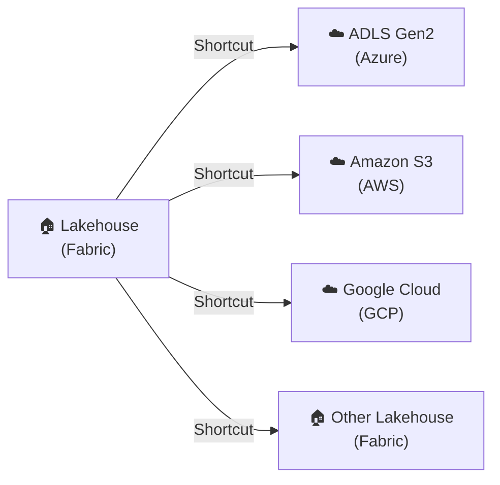

# 00 — Microsoft Fabric Prerequisites & Core Concepts

> - Based on: *Microsoft Fabric documentation* (Microsoft Learn)
> - 📁 [← Back to Home](/dp-700-study-notes/)

---

## 🏗️ Microsoft Fabric Architecture

### What is Microsoft Fabric?

Microsoft Fabric is an **end-to-end, unified analytics platform** that brings together data engineering, data integration, data warehousing, real-time intelligence, data science, and business intelligence into a single SaaS product.

---

### OneLake — The Unified Data Lake

OneLake is Fabric's **single, unified, logical data lake** for the entire organization — think of it as the "OneDrive for data."

| Attribute | Detail |
|-----------|--------|
| Storage format | **Delta Lake** (Parquet + transaction log) |
| Protocol | **ADLS Gen2-compatible** (abfss://) |
| Multi-cloud | Supports **OneLake shortcuts** to Azure, AWS S3, GCS |
| Governance | Centralized — one copy of data, one set of permissions |
| Hierarchy | Tenant → Workspace → Lakehouse/Warehouse → Tables/Files |

> **Exam Caveat ⚠️:** OneLake is **not** a separate Azure resource — it comes automatically with every Fabric tenant. There is no need to provision storage accounts separately.

---

## 🧊 Lakehouse vs Warehouse

Understanding when to use a **Lakehouse** vs a **Warehouse** is one of the most frequently tested concepts on the DP-700.

### Decision Flow

### Comparison Table

| Feature | Lakehouse | Warehouse |
|---------|-----------|-----------|
| **Storage format** | Delta Lake (Parquet) | Delta Lake (Parquet) |
| **Primary engine** | Apache Spark (PySpark, Spark SQL) | T-SQL |
| **SQL access** | SQL Analytics Endpoint (read-only, auto-generated) | Full T-SQL (read/write) |
| **Schema support** | Schema-on-read + schema-on-write | Schema-on-write |
| **File support** | Managed tables + unmanaged files (Files/) | Tables only |
| **Stored procedures** | Not supported | Supported |
| **Cross-database queries** | Via shortcuts | Native cross-database queries |
| **Best for** | Data engineers, data scientists, mixed workloads | SQL analysts, BI workloads, traditional DW |

> **Exam Caveat ⚠️:** The Lakehouse's **SQL Analytics Endpoint** is **read-only** — you cannot INSERT, UPDATE, or DELETE via T-SQL on a Lakehouse. For write operations via T-SQL, use a Warehouse.

---

## ⚡ Fabric Capacity & Licensing

### Capacity Units (CUs)

Fabric is licensed via **capacities**, measured in **Capacity Units (CUs)**.

| SKU | CUs | Spark vCores | Typical Use |
|-----|-----|-------------|-------------|
| **F2** | 2 | 8 | Dev/test |
| **F4** | 4 | 16 | Small team |
| **F8** | 8 | 32 | Small production |
| **F16** | 16 | 64 | Medium production |
| **F32** | 32 | 128 | Large production |
| **F64** | 64 | 256 | Enterprise |
| **F128+** | 128+ | 512+ | Large enterprise |

> **Exam Caveat ⚠️:** Fabric uses a **consumption-based model** — different workloads (Spark, SQL, Dataflow Gen2, pipeline) consume CUs at different rates. Spark jobs tend to be the heaviest CU consumers.

---

## 🔄 Fabric Item Types

---

## 📁 Delta Lake Fundamentals

Delta Lake is the **default storage format** in Microsoft Fabric. It's an open-source storage layer that adds ACID transactions to Apache Spark and big data workloads.

### Key Features

| Feature | Description |
|---------|-------------|
| **ACID Transactions** | Atomic, consistent, isolated, durable operations on data lakes |
| **Schema Enforcement** | Rejects writes that don't match the table schema |
| **Schema Evolution** | Supports adding new columns via `mergeSchema` option |
| **Time Travel** | Query previous versions of data using `VERSION AS OF` or `TIMESTAMP AS OF` |
| **OPTIMIZE** | Compacts small files into larger ones for better read performance |
| **VACUUM** | Removes old files no longer referenced by the transaction log |
| **V-Order** | Fabric-specific optimization — columnar sorting for faster reads |
| **Z-Order** | Co-locates related data for faster filtering on specific columns |

### Delta Lake File Structure

> **Exam Caveat ⚠️:**
> - **OPTIMIZE** compacts small files but does **not** remove old files — you need **VACUUM** for that
> - **VACUUM** default retention is **7 days** — running `VACUUM` with a shorter retention can break time travel
> - **V-Order** is a Fabric-specific optimization that is **enabled by default** in Fabric lakehouses

---

## 🔗 OneLake Shortcuts

Shortcuts are **pointers** to data stored in other locations — they allow you to access external data without copying it into OneLake.

### Supported Shortcut Sources

| Source | Protocol | Notes |
|--------|----------|-------|
| **Another OneLake location** | Internal | Cross-workspace, cross-lakehouse |
| **Azure Data Lake Storage Gen2** | abfss:// | External Azure storage |
| **Amazon S3** | s3:// | Cross-cloud |
| **Google Cloud Storage** | gs:// | Cross-cloud |
| **Dataverse** | Dataverse API | Power Platform integration |

> **Exam Caveat ⚠️:**
> - Shortcuts provide **read access** to external data — the data is **not copied** into OneLake
> - Security on shortcut data is governed by **both** the source permissions **and** OneLake permissions
> - Shortcuts appear as regular folders/tables in the Lakehouse

---

## 🔧 Core Languages in Fabric

| Language | Where Used | Best For |
|----------|-----------|----------|
| **PySpark** | Notebooks, Spark Job Definitions | Large-scale data transformation, complex ETL |
| **Spark SQL** | Notebooks (via `%%sql` magic) | SQL-based transforms on Lakehouse tables |
| **T-SQL** | Warehouse, SQL Analytics Endpoint | Traditional SQL workloads, stored procedures |
| **KQL (Kusto Query Language)** | Eventhouse, KQL Database | Real-time analytics, log analysis, time-series |
| **DAX** | Semantic Models, Power BI | Business intelligence calculations |
| **M (Power Query)** | Dataflow Gen2 | No-code/low-code data transformation |

> **Exam Caveat ⚠️:** The exam expects you to know **when** to use each language, not necessarily write complex code. Typical questions: "Which language should you use to transform streaming data in an Eventhouse?" → **KQL**.

---

## 🧭 Fabric vs Azure Data Services

| Feature | Microsoft Fabric | Azure Data Factory + Synapse |
|---------|-----------------|------------------------------|
| **Deployment** | SaaS (no Azure resources to manage) | PaaS (you manage resources) |
| **Data lake** | OneLake (automatic) | ADLS Gen2 (you provision) |
| **Compute** | Shared capacity (CUs) | Dedicated pools / integration runtimes |
| **Licensing** | Capacity-based (F SKUs) | Per-resource pricing |
| **Unified experience** | Single portal (app.fabric.microsoft.com) | Multiple portals (portal.azure.com, Synapse Studio) |
| **Real-time** | Eventstreams + Eventhouse (built-in) | Event Hubs + Stream Analytics (separate services) |
| **Governance** | Built-in (Purview integration) | Separate Purview deployment |

---

## 📊 Quick-Reference Scenario Table

| Scenario | Requirement | Fabric Component |
|----------|-------------|-----------------|
| SQL analysts need to write stored procedures | T-SQL read/write | **Warehouse** |
| Data engineers need PySpark + SQL on same data | Mixed engine | **Lakehouse** |
| Access external ADLS Gen2 without copying | Virtual access | **OneLake Shortcut** |
| No-code data transformation | Low-code ETL | **Dataflow Gen2** |
| Real-time event processing and analytics | Streaming + KQL | **Eventstream → Eventhouse** |
| Orchestrate multi-step data pipelines | Workflow engine | **Data Pipeline** |
| Complex PySpark transformations | Code-first ETL | **Notebook** |
| Build BI reports on Lakehouse data | Business intelligence | **Semantic Model + Power BI** |
