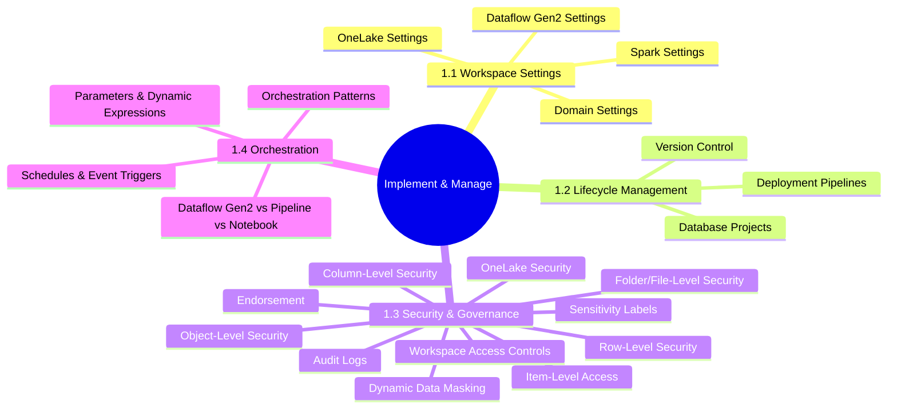
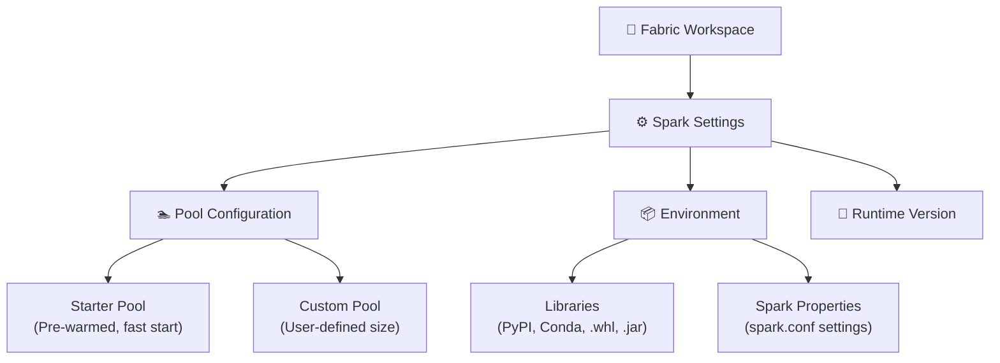
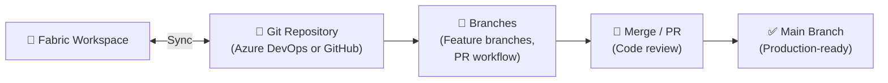
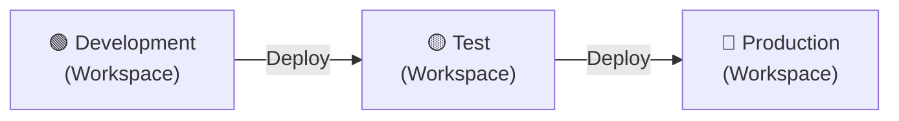
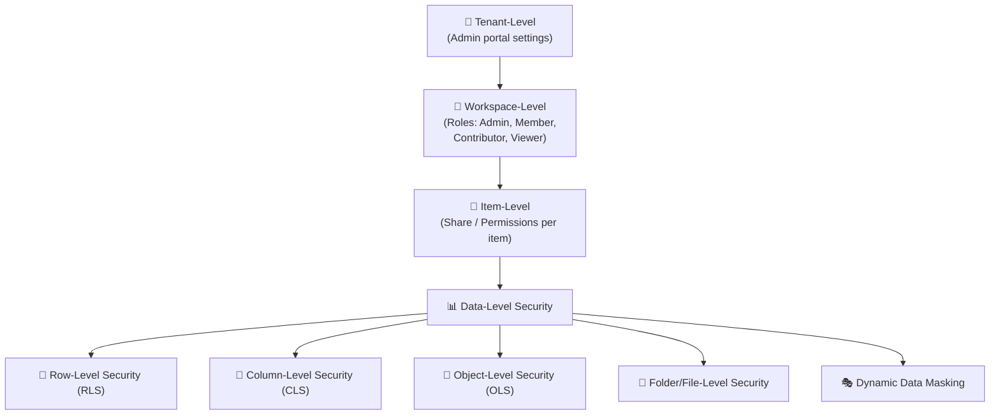
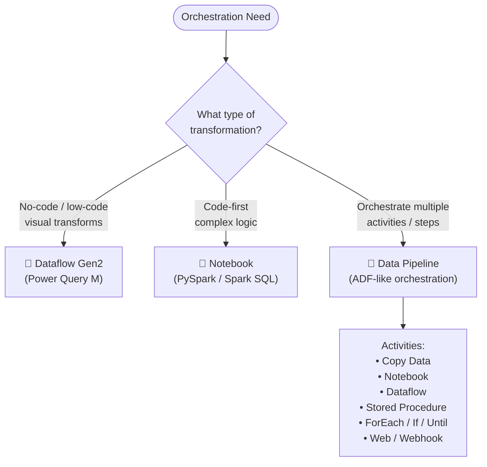
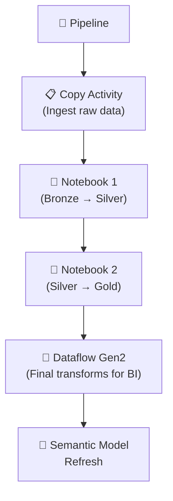

# 01 — Implement & Manage an Analytics Solution
> **Official Exam Weight: 30–35%**
> 📁 [← Back to Home](/dp-700-study-notes/)

---

## 🗺 Domain Overview



---

## ⚙️ 1.1 Configure Microsoft Fabric Workspace Settings

### Spark Workspace Settings

| Setting | Description | Impact |
|---------|-------------|--------|
| **Default runtime** | Spark runtime version (e.g., Runtime 1.2, 1.3) | Determines Spark, Python, R, Delta Lake versions |
| **Starter pools** | Pre-warmed Spark pools for fast start | Reduces cold start from ~3 min to ~15 sec |
| **Custom pools** | Configure node size, autoscale, dynamic allocation | Control compute for specific workloads |
| **Environment** | Attach libraries, Spark properties, resource files | Consistent dependencies across notebooks |
| **Native execution engine** | Hardware-accelerated Spark execution | Up to 4x faster for supported operations |
| **High concurrency mode** | Share Spark sessions across notebooks | Saves CU consumption when multiple users work simultaneously |
| **Automatic log retention** | Spark logs and event log retention | Debugging and monitoring |



> **Exam Caveat ⚠️:**
> - **Starter pools** provide fast notebook start times but consume CUs even when idle
> - **Environments** can be shared across multiple notebooks within a workspace
> - The **native execution engine** does not support all Spark operations — unsupported ops fall back to standard Spark

---

### Domain Workspace Settings

**Domains** in Fabric are a way to **group workspaces** by business area (e.g., Finance, Marketing, Engineering).

| Feature | Description |
|---------|-------------|
| **Domain assignment** | Assign a workspace to a specific domain |
| **Domain roles** | Domain admins, domain contributors |
| **Data governance** | Policies and endorsement can be applied at domain level |
| **Discovery** | Users can discover workspaces within their domain in the data hub |

---

### OneLake Workspace Settings

| Setting | Description |
|---------|-------------|
| **OneLake data access** | Control whether OneLake data can be accessed via ADLS Gen2 APIs |
| **Users can only access data via Fabric items** | Restrict direct OneLake access — force access through Fabric items |

> **Exam Caveat ⚠️:** When "Users can only access data via Fabric items" is enabled, external tools that connect via ADLS Gen2 APIs (like Azure Storage Explorer) will be blocked.

---

### Dataflow Gen2 Workspace Settings

| Setting | Description |
|---------|-------------|
| **Data destination defaults** | Default Lakehouse or Warehouse for Dataflow Gen2 outputs |
| **Staging Lakehouse** | Workspace-level staging Lakehouse for Dataflow Gen2 processing |

---

## 🔄 1.2 Implement Lifecycle Management in Fabric

### Version Control (Git Integration)

Fabric supports **Git integration** for version-controlling workspace items.



**Supported Git providers:**

| Provider | Support |
|----------|---------|
| **Azure DevOps** | Fully supported |
| **GitHub** | Fully supported |
| **Other Git** | Not supported natively |

**Items that support Git integration:**

| Item | Git Support |
|------|-------------|
| Notebooks | ✅ |
| Spark Job Definitions | ✅ |
| Pipelines | ✅ |
| Semantic Models | ✅ |
| Reports | ✅ |
| Lakehouses (metadata) | ✅ |
| Warehouses (metadata) | ✅ |
| Dataflow Gen2 | ✅ |
| Environments | ✅ |

> **Exam Caveat ⚠️:**
> - Git integration syncs **item definitions** (metadata), not the **data** itself
> - Each workspace connects to **one branch** at a time — you switch branches at workspace level
> - Conflicts must be resolved before syncing

---

### Database Projects

**Database projects** provide a **code-first, schema-as-code** approach for managing Warehouse schemas.

| Feature | Description |
|---------|-------------|
| **SQL project** | Version-controlled set of SQL scripts defining schema |
| **Schema compare** | Compare project schema vs deployed warehouse |
| **Publish** | Deploy schema changes from project to warehouse |
| **IDE support** | VS Code with SQL Database Projects extension |

---

### Deployment Pipelines

Deployment pipelines enable **CI/CD for Fabric** — promoting items across environments.



| Feature | Description |
|---------|-------------|
| **Stages** | Up to 10 stages (typically: Dev → Test → Prod) |
| **Deployment rules** | Override data sources, parameters per stage |
| **Selective deployment** | Deploy individual items or all items |
| **Auto-binding** | Deployed items maintain relationships |
| **Comparison view** | See differences between stages before deploying |

> **Exam Caveat ⚠️:**
> - Deployment pipelines deploy **item definitions**, not data
> - You need **at least Contributor** on both source and target workspaces
> - Deployment pipelines and Git integration **can be used together** — Git for code versioning, pipelines for environment promotion

---

## 🔒 1.3 Configure Security & Governance

### Security Layers in Fabric



---

### Workspace-Level Access Controls

| Role | Permissions |
|------|------------|
| **Admin** | Full control — manage settings, members, delete workspace |
| **Member** | Create, edit, delete items; share items; cannot manage workspace settings |
| **Contributor** | Create, edit, delete items; cannot share or manage members |
| **Viewer** | View items only; cannot edit, create, or delete |

> **Exam Caveat ⚠️:** Workspace **Viewer** role does not automatically grant access to the underlying **data** — additional item-level or data-level permissions may be needed.

---

### Item-Level Access Controls

You can share individual Fabric items (Lakehouse, Warehouse, Report, etc.) with specific users, granting:

| Permission | What It Grants |
|-----------|---------------|
| **Read** | View item metadata and content |
| **ReadAll** | Read all data in the item (bypasses data-level security for some items) |
| **ReadData** | Read data via SQL (Warehouse, SQL Analytics Endpoint) |
| **Write** | Edit the item |
| **Reshare** | Share the item with others |

---

### Row-Level Security (RLS)

RLS restricts **which rows** a user can see based on filters.

**Where RLS is supported:**

| Item | RLS Method |
|------|-----------|
| **Warehouse** | T-SQL `CREATE SECURITY POLICY` + `FUNCTION` |
| **SQL Analytics Endpoint** | Same as Warehouse |
| **Semantic Model** | DAX filter expressions in Power BI |
| **Lakehouse (via SQL)** | Via SQL Analytics Endpoint |

```sql
-- Example: RLS in a Fabric Warehouse
CREATE FUNCTION dbo.fn_SecurityPredicate(@Region AS NVARCHAR(50))
    RETURNS TABLE
    WITH SCHEMABINDING
AS
    RETURN SELECT 1 AS result
    WHERE @Region = USER_NAME()
    OR USER_NAME() = 'admin@contoso.com';

CREATE SECURITY POLICY RegionFilter
    ADD FILTER PREDICATE dbo.fn_SecurityPredicate(Region) ON dbo.Sales;
```

---

### Column-Level Security (CLS)

CLS restricts **which columns** a user can see.

```sql
-- Example: Grant SELECT on specific columns only
GRANT SELECT ON dbo.Employees(Name, Department, Title) TO [analyst@contoso.com];
-- The Salary column is NOT included — the user cannot see it
```

> **Exam Caveat ⚠️:** CLS is supported in **Warehouse** and **SQL Analytics Endpoint** via T-SQL `GRANT`/`DENY` on specific columns.

---

### Object-Level Security (OLS)

OLS hides **entire tables or columns** from users in **Semantic Models** (Power BI).

| Aspect | Detail |
|--------|--------|
| **Where** | Semantic Models only |
| **How** | Define OLS roles in the model with `none` permission on sensitive tables/columns |
| **Effect** | Objects are completely invisible to restricted users |

---

### Folder/File-Level Security (OneLake)

| Feature | Description |
|---------|-------------|
| **OneLake data access roles** | Define roles that grant access to specific folders within a Lakehouse |
| **Granularity** | Folder-level within the Lakehouse Files section |
| **Inheritance** | Permissions inherit to subfolders unless overridden |

---

### Dynamic Data Masking (DDM)

DDM **masks data at query time** without changing stored data.

| Mask Function | Effect | Example |
|--------------|--------|---------|
| **Default** | Full mask based on data type | `XXXX` for strings, `0` for numbers |
| **Email** | Shows first char + `XXX@XXX.com` | `mXXX@XXXX.com` |
| **Partial** | Shows prefix + padding + suffix | `Cus-XXXX-er` |
| **Random** | Random number in specified range | `42` (random) |

```sql
-- Example: Apply dynamic data masking in Warehouse
ALTER TABLE dbo.Customers
ALTER COLUMN Email ADD MASKED WITH (FUNCTION = 'email()');

ALTER TABLE dbo.Customers
ALTER COLUMN CreditCard ADD MASKED WITH (FUNCTION = 'partial(0,"XXXX-XXXX-XXXX-",4)');
```

> **Exam Caveat ⚠️:** Users with `UNMASK` permission can see the original data. DDM is **not** a security boundary for users with elevated database permissions.

---

### Sensitivity Labels

| Feature | Description |
|---------|-------------|
| **Source** | Microsoft Purview Information Protection |
| **Apply to** | Any Fabric item (Lakehouse, Warehouse, Report, etc.) |
| **Labels** | E.g., Public, General, Confidential, Highly Confidential |
| **Inheritance** | Labels propagate downstream (e.g., Lakehouse → Report) |
| **Encryption** | Can enforce encryption on exported data |

---

### Item Endorsement

| Endorsement Level | Meaning | Who Can Apply |
|-------------------|---------|---------------|
| **Promoted** | Recommended for use | Item owner, workspace member |
| **Certified** | Meets organization's quality standards | Designated certifiers (admin-defined) |
| **Master data** | Authoritative source of truth | Designated certifiers |

---

### Audit Logs

| Feature | Description |
|---------|-------------|
| **Source** | Microsoft 365 Unified Audit Log |
| **Access** | Microsoft Purview compliance portal |
| **Events** | Item creation, deletion, access, sharing, data access |
| **Retention** | Depends on Microsoft 365 licence (90 days default, up to 10 years with E5) |
| **API** | Management Activity API for programmatic access |

---

### OneLake Security

| Feature | Description |
|---------|-------------|
| **Workspace roles** | Primary mechanism for OneLake data access |
| **OneLake data access roles** | Fine-grained access within a Lakehouse |
| **Shortcut security** | Source permissions + OneLake permissions both apply |
| **Encryption** | Data encrypted at rest (Microsoft-managed keys) |

---

## 🔀 1.4 Orchestrate Processes

### Choosing the Right Orchestration Tool



### Comparison Table

| Feature | Dataflow Gen2 | Notebook | Data Pipeline |
|---------|--------------|----------|---------------|
| **Persona** | Citizen developer, analyst | Data engineer, data scientist | Data engineer, orchestrator |
| **Language** | M (Power Query) | PySpark, Spark SQL, R | Visual designer + expressions |
| **Code required** | No (visual UI) | Yes | Minimal (visual + expressions) |
| **Best for** | Simple transforms, mashups | Complex transforms, ML, large data | Orchestrating multi-step workflows |
| **Data movement** | Built-in connectors (150+) | Read/write via Spark | Copy activity (90+ connectors) |
| **Scalability** | Medium | High (Spark cluster) | Depends on activity type |
| **Triggers** | Schedule | Schedule, pipeline, on-demand | Schedule, event-based, tumbling window |

> **Exam Caveat ⚠️:**
> - **Dataflow Gen2** is the replacement for Dataflow Gen1 (Power BI Dataflows) — Gen2 can write to Lakehouse, Warehouse, KQL Database
> - **Pipelines** can call Notebooks and Dataflow Gen2 as activities — use pipelines as the orchestration layer
> - A **Notebook** can also orchestrate by calling other notebooks via `%run` or `mssparkutils.notebook.run()`

---

### Schedules and Event-Based Triggers

| Trigger Type | Description | Use Case |
|-------------|-------------|----------|
| **Schedule** | Run at specific times (cron-like) | Daily/hourly ETL jobs |
| **Event-based** | React to events (e.g., file arrival) | Process files as they land in OneLake |
| **Tumbling window** | Fixed-size, non-overlapping time windows | Process data in hourly/daily batches |
| **On-demand** | Manual or API trigger | Ad-hoc runs, testing |

---

### Orchestration Patterns with Notebooks and Pipelines

#### Parameters and Dynamic Expressions

**Pipeline parameters:**

```json
{
  "sourcePath": "@pipeline().parameters.InputFolder",
  "fileName": "@concat(pipeline().parameters.Prefix, '_', formatDateTime(utcnow(), 'yyyyMMdd'), '.parquet')"
}
```

**Notebook parameters (via `%%configure` or pipeline):**

```python
# Notebook parameter cell (tagged as "parameters")
input_path = "abfss://workspace@onelake.dfs.fabric.microsoft.com/lakehouse.Lakehouse/Files/raw/"
output_table = "cleaned_sales"
load_date = "2026-04-08"
```

**Common orchestration patterns:**



---

## 📊 Quick-Reference Scenario Table

| Scenario | Requirement | Answer |
|----------|-------------|--------|
| Promote items from Dev → Test → Prod | Environment promotion | **Deployment Pipelines** |
| Version-control notebook code | Source control | **Git Integration (Azure DevOps / GitHub)** |
| Restrict users to see only their region's data | Data filtering | **Row-Level Security (RLS)** |
| Hide salary column from analysts | Column restriction | **Column-Level Security (CLS)** |
| Mask email addresses in query results | Data masking | **Dynamic Data Masking (DDM)** |
| Orchestrate Copy → Notebook → Dataflow sequence | Multi-step workflow | **Data Pipeline** |
| No-code transform CSV to Lakehouse table | Visual ETL | **Dataflow Gen2** |
| Complex PySpark transform on large dataset | Code-first ETL | **Notebook** |
| Trigger pipeline when file lands in OneLake | Event-driven | **Event-based trigger** |
| Track who accessed what data | Audit trail | **Microsoft 365 Unified Audit Log** |
| Mark a dataset as trusted and organization-approved | Data quality signal | **Certified endorsement** |
| Control Spark cluster size for a workspace | Compute management | **Custom pool in Spark settings** |
| Schema-as-code for Warehouse | Version-controlled schema | **Database Projects** |

---

[← 00 — Fabric Prerequisites](/dp-700-study-notes/00-fabric-prerequisites/) | [02 — Ingest & Transform Data →](/dp-700-study-notes/02-ingest-transform-data/)