# 02 — Ingest & Transform Data
> **Official Exam Weight: 30–35%**
> 📁 [← Back to Home](/dp-700-study-notes/)

---

## 🗺 Domain Overview

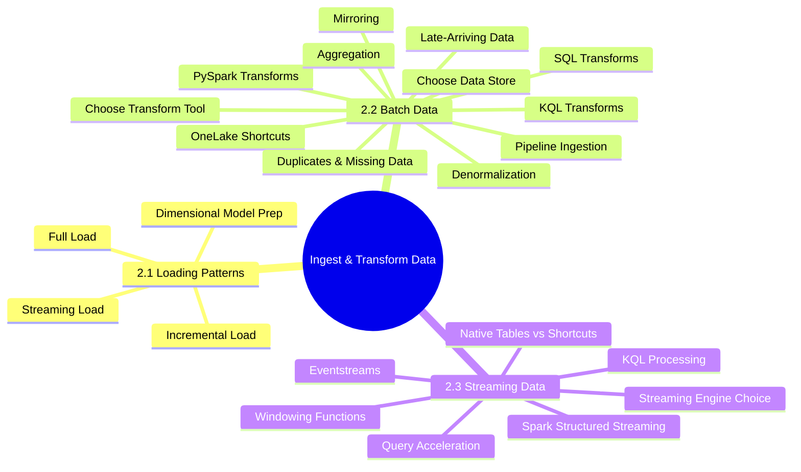

---

## 📥 2.1 Design & Implement Loading Patterns

### Full Load vs Incremental Load

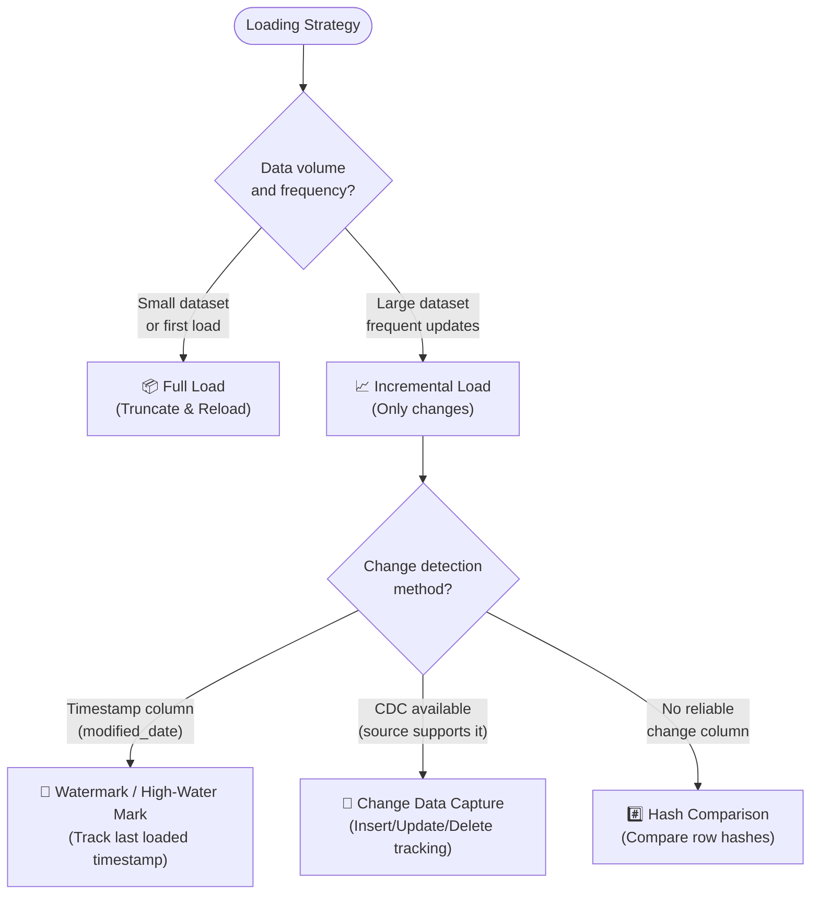

### Comparison Table

| Aspect | Full Load | Incremental Load |
|--------|-----------|-----------------|
| **Data transferred** | Entire dataset every run | Only new/changed rows |
| **Complexity** | Simple | More complex (change detection) |
| **Duration** | Longer (proportional to total size) | Shorter (proportional to changes) |
| **Target operation** | Truncate + insert | Merge / upsert / append |
| **Idempotent** | Yes (always same result) | Requires careful design |
| **Best for** | Small reference tables, initial loads | Large fact tables, frequent updates |

> **Exam Caveat ⚠️:**
> - **Watermark/high-water mark** is the simplest incremental pattern — requires a reliable `modified_date` or `version` column in the source
> - **MERGE** (Delta Lake) is the preferred method for upserts in Fabric Lakehouses
> - For **CDC from Azure SQL/SQL Server**, use Fabric's **Mirroring** feature

---

### Preparing Data for a Dimensional Model

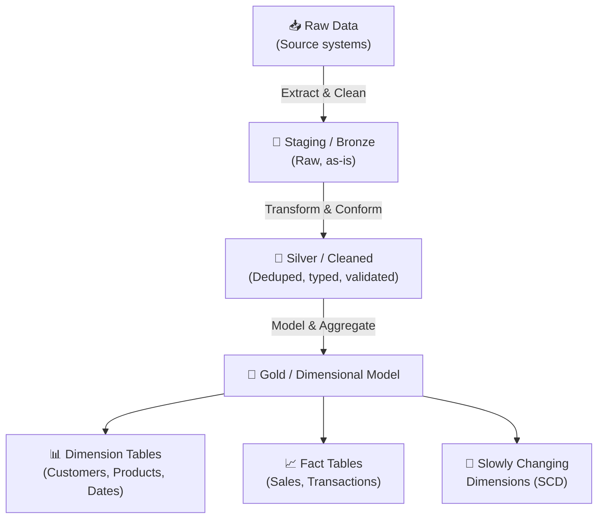

**Slowly Changing Dimensions (SCD):**

| Type | Name | Behaviour | Implementation |
|------|------|-----------|----------------|
| **SCD Type 1** | Overwrite | Replace old value with new | Simple UPDATE |
| **SCD Type 2** | History | Keep full history with valid_from/valid_to | Add new row, close old row |
| **SCD Type 3** | Previous value | Keep current + previous value | Add previous_value column |

> **Exam Caveat ⚠️:** SCD Type 2 is the most common exam scenario — know how to implement it with Delta Lake MERGE operations including `valid_from`, `valid_to`, and `is_current` columns.

---

### Streaming Data Loading Patterns

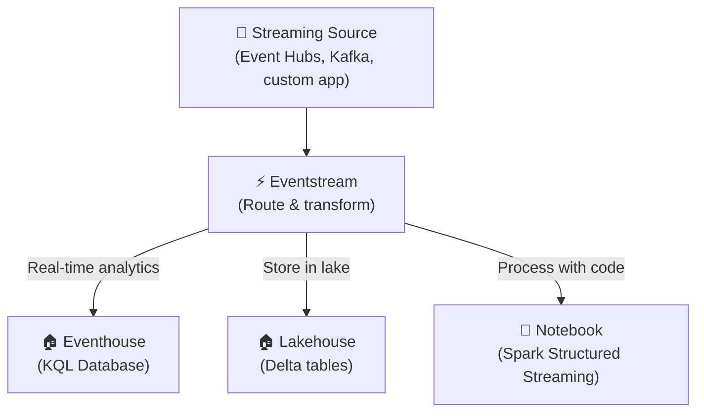

---

## 🔄 2.2 Ingest & Transform Batch Data

### Choosing an Appropriate Data Store

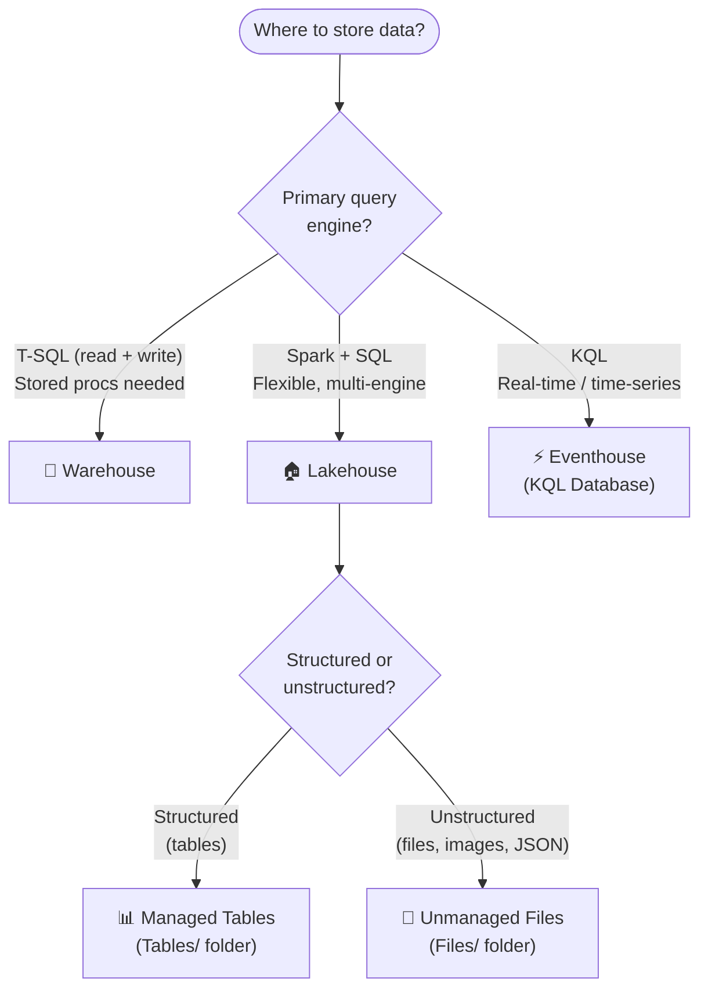

---

### Choosing the Right Transform Tool

| Need | Tool | Language |
|------|------|---------|
| No-code visual transforms, 150+ connectors | **Dataflow Gen2** | M (Power Query) |
| Complex transforms on large data | **Notebook** | PySpark / Spark SQL |
| Real-time analytics transforms | **KQL** | Kusto Query Language |
| SQL-based transforms in Warehouse | **T-SQL** | T-SQL |
| Simple SQL on Lakehouse tables | **Notebook (`%%sql`)** | Spark SQL |

---

### OneLake Shortcuts

Shortcuts provide **virtual access** to data without copying.

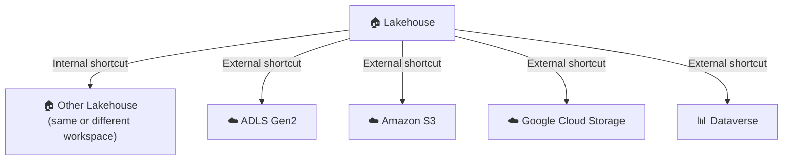

| Shortcut Type | Data Copied? | Latency | Security |
|--------------|-------------|---------|----------|
| **Internal (OneLake → OneLake)** | No | Low | OneLake permissions |
| **External (ADLS Gen2, S3, GCS)** | No | Higher (cross-service) | Source + OneLake permissions |
| **Dataverse** | No | Medium | Dataverse + OneLake permissions |

> **Exam Caveat ⚠️:**
> - Shortcuts appear as regular folders in the Lakehouse — Spark and SQL can query them transparently
> - External shortcuts have **higher latency** than native OneLake data — consider this for performance-critical queries
> - Shortcut data is **not included** in OPTIMIZE or VACUUM operations — it's managed at the source

---

### Mirroring

Mirroring creates a **near real-time replica** of data from external sources into OneLake.

| Source | Support | Latency |
|--------|---------|---------|
| **Azure SQL Database** | GA | Near real-time |
| **Azure Cosmos DB** | GA | Near real-time |
| **Snowflake** | GA | Near real-time |
| **Azure SQL Managed Instance** | GA | Near real-time |
| **Azure Database for PostgreSQL** | GA | Near real-time |
| **Azure Database for MySQL** | GA | Near real-time |

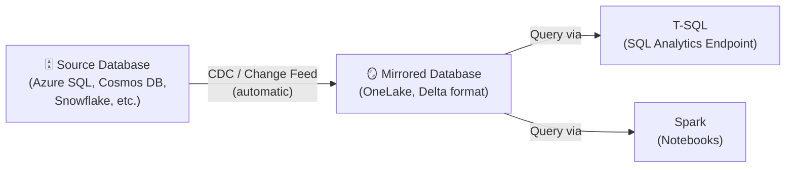

> **Exam Caveat ⚠️:**
> - Mirroring vs Shortcuts: **Mirroring copies data** into OneLake (near real-time CDC), while **shortcuts point to data** without copying
> - Mirrored data is stored in **Delta format** and can be queried by Spark and SQL
> - Mirroring is **one-way** — changes in OneLake are NOT pushed back to the source

---

### Ingest Data by Using Pipelines

**Copy Activity** is the primary pipeline activity for data ingestion.

| Feature | Description |
|---------|-------------|
| **Source connectors** | 90+ connectors (databases, files, SaaS apps) |
| **Destination** | Lakehouse (Tables or Files), Warehouse, KQL Database |
| **Format support** | Parquet, CSV, JSON, ORC, Avro, Delta |
| **Parallelism** | Configurable degree of copy parallelism |
| **Staging** | Optional staging via ADLS Gen2 for large copies |

---

### Transform Data by Using PySpark

#### Common PySpark Patterns

**Read & write Delta tables:**

```python
# Read from Lakehouse table
df = spark.read.format("delta").load("Tables/raw_sales")

# Transform
from pyspark.sql.functions import col, year, month, sum as _sum

df_clean = (df
    .filter(col("amount") > 0)
    .withColumn("year", year("order_date"))
    .withColumn("month", month("order_date"))
    .dropDuplicates(["order_id"])
)

# Write to Lakehouse table
df_clean.write.format("delta").mode("overwrite").saveAsTable("cleaned_sales")
```

**Delta MERGE (upsert):**

```python
from delta.tables import DeltaTable

target = DeltaTable.forName(spark, "gold_customers")

(target.alias("t")
    .merge(df_new.alias("s"), "t.customer_id = s.customer_id")
    .whenMatchedUpdateAll()
    .whenNotMatchedInsertAll()
    .execute()
)
```

**Partitioning:**

```python
# Write partitioned by year and month
df.write.format("delta") \
    .partitionBy("year", "month") \
    .mode("overwrite") \
    .saveAsTable("partitioned_sales")
```

---

### Transform Data by Using SQL (T-SQL)

```sql
-- Create a transformed table in Warehouse
CREATE TABLE gold.monthly_sales AS
SELECT
    YEAR(order_date)  AS sale_year,
    MONTH(order_date) AS sale_month,
    region,
    SUM(amount)       AS total_amount,
    COUNT(*)          AS order_count
FROM staging.raw_sales
WHERE amount > 0
GROUP BY YEAR(order_date), MONTH(order_date), region;
```

**CTAS (CREATE TABLE AS SELECT)** is commonly used in Fabric Warehouses for large transforms.

---

### Transform Data by Using KQL

```kql
// Aggregate events by hour in an Eventhouse
SensorReadings
| where Timestamp > ago(7d)
| summarize AvgTemp = avg(Temperature),
            MaxTemp = max(Temperature),
            ReadingCount = count()
  by bin(Timestamp, 1h), DeviceId
| order by Timestamp desc
```

---

### Denormalize Data

| Pattern | Description | Use Case |
|---------|-------------|----------|
| **Flatten** | Join dimension into fact table | Star schema → flat table for BI |
| **Nest** | Store related data as struct/array | Semi-structured data in Delta |
| **Pre-aggregate** | Compute aggregates ahead of time | Dashboard performance |

---

### Handle Duplicate, Missing, and Late-Arriving Data

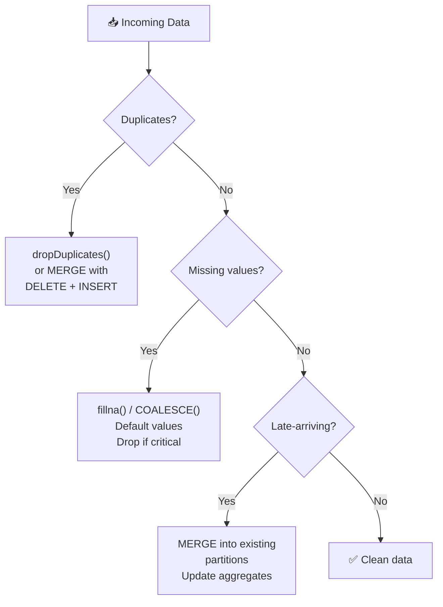

> **Exam Caveat ⚠️:**
> - **Late-arriving data** in streaming scenarios is handled via **watermarks** in Spark Structured Streaming
> - In batch scenarios, use **MERGE** to upsert late-arriving records into the correct partition
> - Always design incremental loads to be **idempotent** — rerunning should produce the same result

---

## ⚡ 2.3 Ingest & Transform Streaming Data

### Choosing an Appropriate Streaming Engine

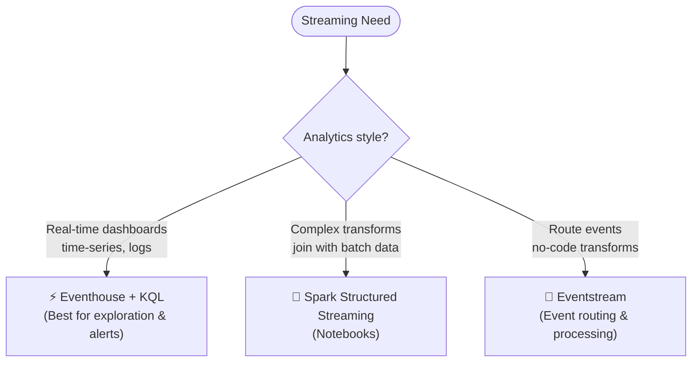

### Comparison

| Feature | Eventstream | Spark Structured Streaming | KQL |
|---------|-------------|---------------------------|-----|
| **Latency** | Seconds | Seconds–minutes | Seconds |
| **Coding** | No-code / low-code | PySpark | KQL queries |
| **Best for** | Event routing, simple transforms | Complex joins, ML on streams | Real-time analytics, alerts |
| **Destination** | Eventhouse, Lakehouse, custom | Lakehouse (Delta) | KQL Database |
| **Windowing** | Basic | Full (tumbling, sliding, session) | Full (tumbling, sliding, hopping) |

---

### Native Tables vs OneLake Shortcuts in Real-Time Intelligence

| Feature | Native KQL Table | OneLake Shortcut |
|---------|-----------------|-----------------|
| **Data location** | Eventhouse (native storage) | OneLake (external reference) |
| **Ingestion** | Direct ingestion, lowest latency | No ingestion — query in place |
| **Performance** | Fastest KQL queries | Slower (cross-service reads) |
| **Use case** | Hot path — active real-time analytics | Warm/cold path — historical lookups |

**Query acceleration for OneLake shortcuts:**

| Feature | Standard Shortcut | Query-Accelerated Shortcut |
|---------|------------------|---------------------------|
| **Caching** | None | Automatic caching in Eventhouse |
| **Performance** | Slower (reads from OneLake) | Faster (reads from cache) |
| **Freshness** | Real-time | Near real-time (cache refresh interval) |
| **Use case** | Infrequent queries on cold data | Frequent queries on shortcut data |

> **Exam Caveat ⚠️:** **Query acceleration** creates a cached copy of shortcut data in the Eventhouse — it improves performance but adds CU consumption and slight data freshness delay.

---

### Process Data by Using Eventstreams

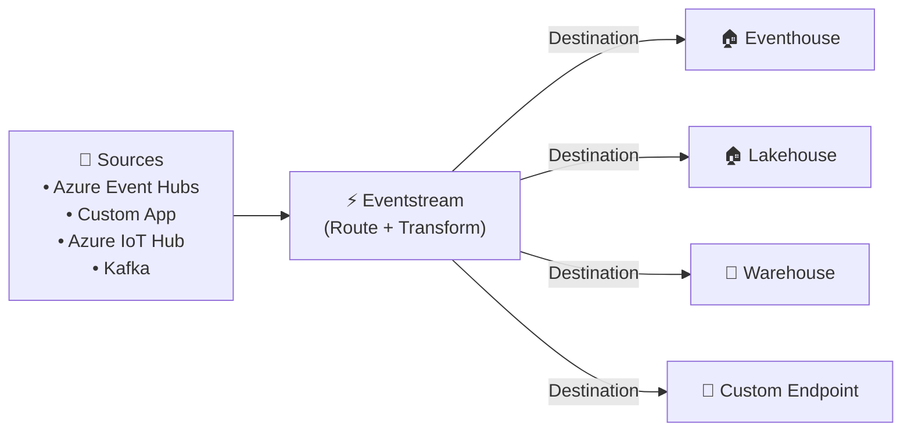

**Eventstream capabilities:**

| Feature | Description |
|---------|-------------|
| **No-code transforms** | Filter, manage fields, group by, aggregate |
| **Multiple destinations** | Route same stream to multiple targets |
| **Schema registry** | Avro, JSON schema support |
| **Error handling** | Dead-letter queue for failed events |

---

### Process Data by Using Spark Structured Streaming

```python
# Read streaming data from Event Hubs via Eventstream
df_stream = (spark.readStream
    .format("delta")
    .option("readChangeFeed", "true")
    .table("bronze_events")
)

# Transform
from pyspark.sql.functions import window, avg, count

df_agg = (df_stream
    .withWatermark("event_time", "10 minutes")
    .groupBy(
        window("event_time", "5 minutes"),
        "device_id"
    )
    .agg(
        avg("temperature").alias("avg_temp"),
        count("*").alias("event_count")
    )
)

# Write to Delta table
(df_agg.writeStream
    .format("delta")
    .outputMode("append")
    .option("checkpointLocation", "Files/checkpoints/sensor_agg")
    .toTable("silver_sensor_aggregates")
)
```

> **Exam Caveat ⚠️:**
> - **Watermark** is required for stateful aggregations on streaming data — it tells Spark how long to wait for late data
> - **Checkpoint location** is mandatory for fault-tolerant streaming — stores offset/state between runs
> - Use **`readChangeFeed`** on Delta tables to read changes as a stream (CDC on Delta)

---

### Windowing Functions

| Window Type | Description | Use Case |
|-------------|-------------|----------|
| **Tumbling** | Fixed-size, non-overlapping, contiguous | "Count events per 5-minute block" |
| **Sliding / Hopping** | Fixed-size, overlapping by slide interval | "Average over last 10 min, updated every 2 min" |
| **Session** | Dynamic size, based on activity gaps | "Group user clicks until 30-min inactivity" |

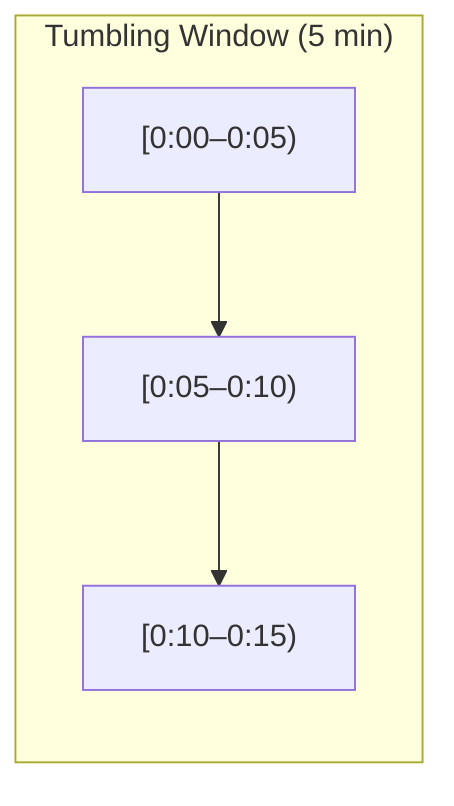

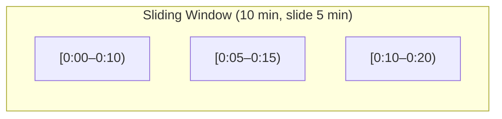

**KQL windowing example:**

```kql
// Tumbling window: events per 5-minute block
SensorReadings
| summarize EventCount = count(), AvgTemp = avg(Temperature)
  by bin(Timestamp, 5m), DeviceId
```

**PySpark windowing example:**

```python
from pyspark.sql.functions import window

df_windowed = (df_stream
    .groupBy(window("event_time", "5 minutes"), "device_id")
    .count()
)
```

---

## 📊 Quick-Reference Scenario Table

| Scenario | Requirement | Answer |
|----------|-------------|--------|
| Copy data from Azure SQL to Lakehouse | Batch ingestion | **Pipeline Copy Activity** |
| No-code transform CSV → Lakehouse table | Visual ETL | **Dataflow Gen2** |
| Complex PySpark join on 100M+ rows | Code-first large-scale | **Notebook** |
| Access ADLS Gen2 data without copying | Virtual access | **OneLake Shortcut** |
| Near real-time replica of Azure SQL | Automatic CDC | **Mirroring** |
| Process IoT events in real-time | Stream routing | **Eventstream → Eventhouse** |
| 5-minute tumbling window aggregation | Streaming analytics | **KQL `bin()` or Spark `window()`** |
| Upsert changed rows into Delta table | Incremental load | **Delta MERGE** |
| Track late-arriving streaming events | Late data handling | **Watermark in Spark Structured Streaming** |
| Query external S3 data from Lakehouse | Cross-cloud access | **OneLake Shortcut (S3)** |
| SCD Type 2 on customer dimension | History tracking | **Delta MERGE with valid_from/valid_to** |
| Aggregate real-time sensor data | Time-series analytics | **KQL in Eventhouse** |
| Speed up queries on shortcut data in RTI | Performance | **Query acceleration** |

---

[← 01 — Implement & Manage an Analytics Solution](/dp-700-study-notes/01-implement-manage-analytics-solution/) | [03 — Monitor & Optimize an Analytics Solution →](/dp-700-study-notes/03-monitor-optimize-analytics-solution/)