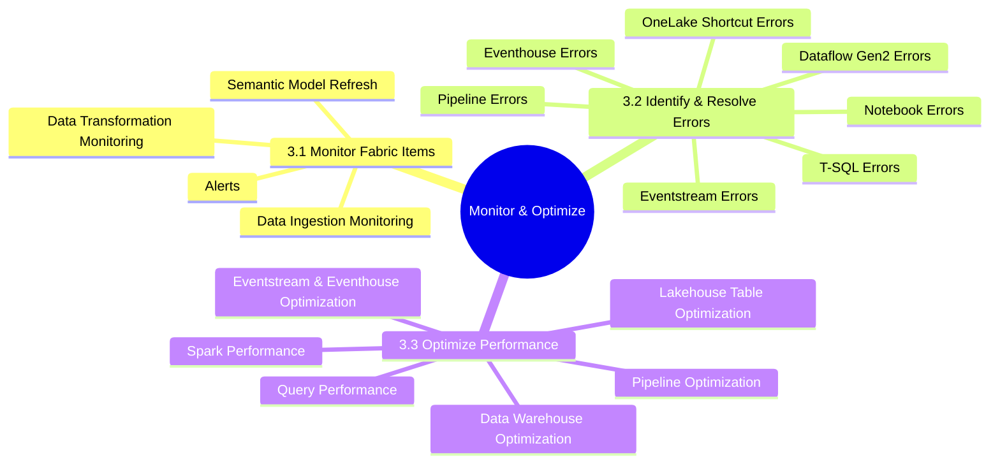
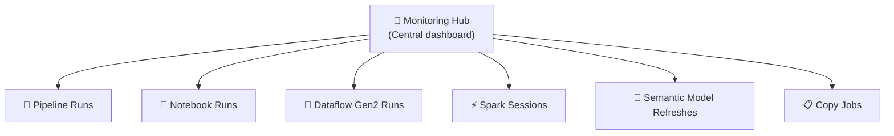
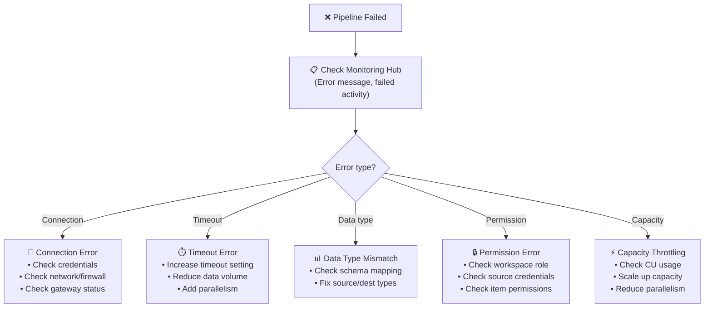
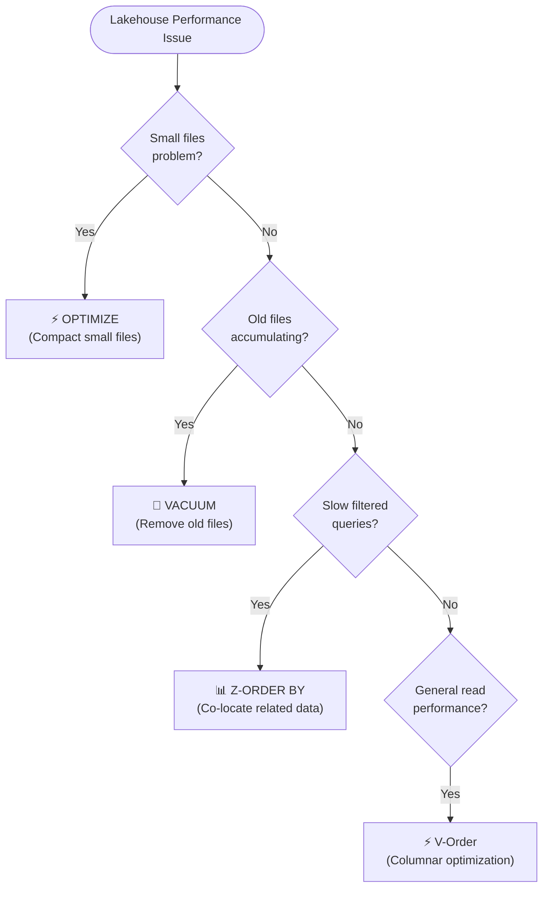
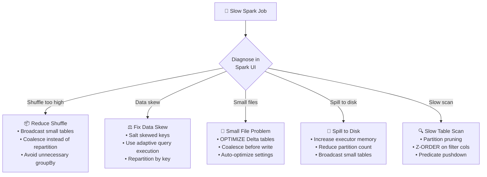

# 03 — Monitor & Optimize an Analytics Solution
> **Official Exam Weight: 30–35%**
> 📁 [← Back to Home](/dp-700-study-notes/)

---

## 🗺 Domain Overview



---

## 📡 3.1 Monitor Fabric Items

### Monitoring Hub

The **Monitoring Hub** is the central place in Fabric to track all running and recent activities.



| Feature | Description |
|---------|-------------|
| **View** | All activities across the workspace |
| **Filter** | By item type, status, time range, submitter |
| **Status** | Running, Succeeded, Failed, Cancelled |
| **Details** | Drill into individual run details, stages, errors |
| **Historical** | View past 30 days of activity |

---

### Monitor Data Ingestion

| What to Monitor | Where | Key Metrics |
|----------------|-------|-------------|
| **Pipeline Copy Activity** | Monitoring Hub → Pipeline runs | Rows read, rows written, duration, throughput (MB/s) |
| **Dataflow Gen2** | Monitoring Hub → Dataflow runs | Rows processed, duration, refresh status |
| **Mirroring** | Mirrored database item | Replication lag, row counts, sync status |
| **Eventstream** | Eventstream monitoring tab | Events in/out, backlog, errors |

> **Exam Caveat ⚠️:** For **Pipeline Copy Activity**, check both **rows read** and **rows written** — a mismatch indicates data loss or filtering during copy.

---

### Monitor Data Transformation

| What to Monitor | Where | Key Metrics |
|----------------|-------|-------------|
| **Notebook / Spark jobs** | Monitoring Hub → Spark sessions | Duration, stages, tasks, shuffle read/write, spill |
| **Spark UI** | Linked from notebook run | DAG visualization, executor metrics, SQL tab |
| **T-SQL queries** | Dynamic Management Views (DMVs) | Query duration, resource usage |

**Key Spark UI tabs:**

| Tab | What It Shows |
|-----|--------------|
| **Jobs** | List of Spark jobs, their stages, duration |
| **Stages** | Task breakdown, shuffle metrics, data skew indicators |
| **SQL** | Physical query plan for Spark SQL operations |
| **Storage** | Cached RDDs/DataFrames, memory usage |
| **Environment** | Spark config, library versions |
| **Executors** | Per-executor metrics (memory, disk, shuffle, GC time) |

---

### Monitor Semantic Model Refresh

| Feature | Description |
|---------|-------------|
| **Monitoring Hub** | View refresh status, duration, error messages |
| **Refresh history** | Available on the semantic model item |
| **Scheduled refresh** | Configure in item settings |
| **On-demand refresh** | Manual trigger or API |

---

### Configure Alerts

| Alert Type | Description | Configuration |
|-----------|-------------|---------------|
| **Data activator** | Alert on data conditions (e.g., value exceeds threshold) | Reflex items |
| **Pipeline failure** | Notify on pipeline run failure | Pipeline settings → notifications |
| **Capacity alerts** | Alert when CU consumption is high | Admin portal → capacity settings |

---

## 🔧 3.2 Identify & Resolve Errors

### Pipeline Errors



**Common pipeline errors and resolutions:**

| Error | Cause | Resolution |
|-------|-------|------------|
| **UserErrorInvalidDataSourceCredentials** | Expired or wrong credentials | Update connection credentials |
| **UserErrorCopyActivityFailed** | Schema mismatch, data type incompatibility | Check column mapping, fix data types |
| **UserErrorActivityTimeout** | Activity exceeded timeout limit | Increase timeout, optimize query |
| **UserErrorCapacityThrottled** | Capacity CU limit exceeded | Scale capacity or reduce parallelism |
| **UserErrorGatewayUnreachable** | On-prem data gateway offline | Restart gateway, check network |

---

### Dataflow Gen2 Errors

| Error | Cause | Resolution |
|-------|-------|------------|
| **Refresh failed: data source error** | Source unavailable or credentials expired | Check source connectivity, refresh credentials |
| **Evaluation timeout** | Transform too complex or data too large | Simplify steps, enable staging, reduce data |
| **Destination error** | Cannot write to target Lakehouse/Warehouse | Check destination exists, permissions, schema |
| **Memory exceeded** | Dataflow ran out of memory | Enable staging Lakehouse, reduce data volume |
| **Duplicate column names** | Column name collision after join/merge | Rename columns before merge |

> **Exam Caveat ⚠️:** When Dataflow Gen2 runs out of memory, the **fix is to enable staging** (workspace-level staging Lakehouse) — this offloads heavy transformations to Spark.

---

### Notebook Errors

| Error | Cause | Resolution |
|-------|-------|------------|
| **OutOfMemoryError** | Data too large for driver/executor memory | Increase node size, repartition data, use broadcast joins carefully |
| **AnalysisException: Table not found** | Wrong table name or path | Verify table exists, check Lakehouse attachment |
| **Py4JJavaError** | Java/Spark internal error | Check Spark UI logs, review stack trace |
| **Session timeout** | Idle session expired | Re-run notebook, adjust session timeout settings |
| **Library not found** | Missing pip/conda package | Add library to Environment or `%pip install` |
| **FileNotFoundException** | File path incorrect or file deleted | Verify path, check if VACUUM removed the file |

---

### Eventhouse Errors

| Error | Cause | Resolution |
|-------|-------|------------|
| **Ingestion failure** | Schema mismatch, format error | Check ingestion mapping, validate source schema |
| **Query timeout** | Query too complex or data too large | Optimize KQL query, add filters, reduce time range |
| **Capacity exceeded** | Eventhouse CU limit | Scale capacity, optimize ingestion rate |
| **Streaming ingestion errors** | Batch size too large, throttling | Reduce batch size, check event schema |

---

### Eventstream Errors

| Error | Cause | Resolution |
|-------|-------|------------|
| **Source connection failure** | Event Hub unavailable or auth failed | Check connection string, SAS policy |
| **Deserialization error** | Event format doesn't match schema | Fix event schema, check serialization format |
| **Destination write failure** | Target unavailable or permission denied | Check destination status and permissions |
| **Backlog growing** | Processing slower than ingestion rate | Scale processing, simplify transforms |

---

### T-SQL Errors

| Error | Cause | Resolution |
|-------|-------|------------|
| **Insufficient permissions** | User lacks required role | Grant appropriate permissions (db_datareader, etc.) |
| **Object does not exist** | Table/view not found | Check schema name, verify object exists |
| **Query cancelled: timeout** | Query exceeded timeout | Optimize query, add indexes, reduce data scanned |
| **Data type conversion** | Implicit conversion failure | Explicit CAST/CONVERT in query |
| **Distributed query failed** | Cross-database query issue | Check permissions on all referenced databases |

---

### OneLake Shortcut Errors

| Error | Cause | Resolution |
|-------|-------|------------|
| **Shortcut target unavailable** | External source down or moved | Verify source path, check source connectivity |
| **Access denied** | Source credentials expired or permissions changed | Update connection credentials, check source IAM |
| **Schema mismatch** | Source data format changed | Update shortcut or schema mapping |
| **Performance degradation** | High latency on external shortcuts | Consider mirroring, or enable query acceleration (RTI) |

---

## 🚀 3.3 Optimize Performance

### Optimize a Lakehouse Table



**Key optimization commands:**

| Command | Purpose | Syntax |
|---------|---------|--------|
| **OPTIMIZE** | Compact small files into larger ones | `OPTIMIZE table_name` |
| **OPTIMIZE + Z-ORDER** | Compact + co-locate data by columns | `OPTIMIZE table_name ZORDER BY (col1, col2)` |
| **VACUUM** | Remove old files beyond retention | `VACUUM table_name RETAIN 168 HOURS` |
| **V-Order** | Fabric-specific columnar write optimization | Enabled by default; `spark.conf.set("spark.sql.parquet.vorder.enabled", "true")` |

```sql
-- Optimize a Delta table (SQL syntax)
OPTIMIZE lakehouse1.gold_sales;

-- Optimize with Z-Order for common filter columns
OPTIMIZE lakehouse1.gold_sales ZORDER BY (region, product_category);

-- Clean up old files (default 7-day retention)
VACUUM lakehouse1.gold_sales;

-- Clean up with custom retention (e.g., 3 days)
VACUUM lakehouse1.gold_sales RETAIN 72 HOURS;
```

> **Exam Caveat ⚠️:**
> - **V-Order** is enabled by default in Fabric and applies at write time — it reorders data within Parquet row groups for faster reads
> - **Z-ORDER** is complementary to V-Order — it co-locates data across files based on specified columns (best for frequently filtered columns)
> - **VACUUM** does NOT compact files — use **OPTIMIZE** for that. VACUUM only deletes old, unreferenced files
> - Running VACUUM with retention < 7 days can break **time travel** queries

---

### Optimize a Pipeline

| Optimization | Description |
|-------------|-------------|
| **Parallelism** | Use ForEach with parallel batches for independent operations |
| **Copy activity tuning** | Increase DIU (Data Integration Units), adjust parallelism |
| **Staging** | Enable staging for large cross-region copies |
| **Selective columns** | Only copy needed columns, not entire tables |
| **Incremental copy** | Use watermark/CDC instead of full copy each run |
| **Pipeline structure** | Minimize sequential dependencies; parallelize where possible |

---

### Optimize a Data Warehouse

| Optimization | Description |
|-------------|-------------|
| **Statistics** | Ensure up-to-date statistics for query optimizer (auto-created) |
| **CTAS pattern** | Use CREATE TABLE AS SELECT for large transforms (avoids logging overhead) |
| **Partition elimination** | Design queries to leverage date/region partitions |
| **Avoid SELECT \*** | Select only needed columns — reduces I/O |
| **Result set caching** | Enabled by default for repeated identical queries |
| **Materialized views** | Pre-compute expensive aggregations (where supported) |

**Key DMVs for Warehouse monitoring:**

| DMV | Purpose |
|-----|---------|
| `sys.dm_exec_requests` | Currently running queries |
| `sys.dm_exec_sessions` | Active sessions |
| `queryinsights.exec_requests_history` | Historical query performance |
| `queryinsights.long_running_queries` | Queries exceeding duration threshold |
| `queryinsights.frequently_run_queries` | Most frequently executed queries |

```sql
-- Find long-running queries in Fabric Warehouse
SELECT *
FROM queryinsights.long_running_queries
ORDER BY start_time DESC;

-- Find top resource-consuming queries
SELECT
    command,
    total_elapsed_time_ms,
    data_processed_mb
FROM queryinsights.exec_requests_history
ORDER BY total_elapsed_time_ms DESC;
```

---

### Optimize Eventstreams and Eventhouses

**Eventstream optimization:**

| Optimization | Description |
|-------------|-------------|
| **Partition key** | Choose a good partition key for parallel processing |
| **Batch size** | Tune ingestion batch size for throughput vs latency |
| **Schema** | Keep events lean — avoid unnecessary fields |

**Eventhouse optimization:**

| Optimization | Description |
|-------------|-------------|
| **Retention policy** | Set appropriate data retention to manage storage |
| **Caching policy** | Configure hot cache duration for frequently queried data |
| **Materialized views** | Pre-aggregate frequently queried patterns |
| **Update policy** | Transform data on ingestion (ETL at ingest time) |
| **Partitioning** | Partition by time for time-series workloads |

```kql
// Check table size and extents
.show table SensorReadings extents
| summarize ExtentCount = count(), TotalRows = sum(RowCount), TotalSize = sum(OriginalSize)

// Set hot cache to 30 days
.alter table SensorReadings policy caching hot = 30d

// Set retention to 365 days
.alter table SensorReadings policy retention softdelete = 365d

// Create a materialized view for hourly aggregates
.create materialized-view HourlySensorAgg on table SensorReadings {
    SensorReadings
    | summarize AvgTemp = avg(Temperature), MaxTemp = max(Temperature)
      by bin(Timestamp, 1h), DeviceId
}
```

---

### Optimize Spark Performance



**Key Spark optimizations:**

| Optimization | How | When |
|-------------|-----|------|
| **Broadcast join** | `broadcast(small_df)` | Small table < 100MB joined with large table |
| **Adaptive Query Execution (AQE)** | Enabled by default in Fabric | Automatic optimization at runtime |
| **Predicate pushdown** | Filter early in the query | Always — reduces data scanned |
| **Partition pruning** | Partition data by frequently filtered columns | Date-based queries on time-partitioned tables |
| **Coalesce** | `df.coalesce(n)` before write | Reduce output file count without full shuffle |
| **Cache** | `df.cache()` or `df.persist()` | Reuse intermediate results multiple times |
| **Native execution engine** | Enable in workspace Spark settings | Supported operations get up to 4x speedup |
| **Dynamic allocation** | Auto-scale executors based on workload | Variable workloads, avoid over-provisioning |

```python
# Broadcast join for small dimension table
from pyspark.sql.functions import broadcast

df_result = df_large.join(broadcast(df_small), "customer_id")

# Coalesce to reduce output files
df_result.coalesce(10).write.format("delta").mode("overwrite").saveAsTable("output_table")

# Cache for repeated use
df_intermediate = df.filter(col("year") == 2026).cache()
count1 = df_intermediate.count()
count2 = df_intermediate.filter(col("region") == "EU").count()
```

> **Exam Caveat ⚠️:**
> - **AQE (Adaptive Query Execution)** is enabled by default in Fabric — it handles skew joins, coalescing shuffle partitions, and converting sort-merge joins to broadcast automatically
> - **`coalesce()` vs `repartition()`**: coalesce reduces partitions without a full shuffle (faster); repartition does a full shuffle (use when you need even distribution)
> - **Broadcast join** fails with OOM if the "small" table is too large — keep it under ~100MB

---

### Optimize Query Performance

**General query optimization principles:**

| Principle | Description |
|-----------|-------------|
| **Filter early** | Push WHERE clauses as early as possible |
| **Select only needed columns** | Avoid SELECT * — reduces I/O |
| **Use appropriate joins** | Broadcast small tables, hash join for large-large |
| **Leverage partitioning** | Query only relevant partitions |
| **Use statistics** | Ensure up-to-date table statistics (auto in Fabric Warehouse) |
| **Avoid UDFs** | PySpark UDFs are slow — use built-in functions |
| **Materialize** | Pre-compute expensive aggregations |

---

## 📊 Quick-Reference Scenario Table

| Scenario | Requirement | Answer |
|----------|-------------|--------|
| Many small Parquet files in Lakehouse | File compaction | **OPTIMIZE** |
| Old Delta file versions consuming storage | Storage cleanup | **VACUUM** |
| Slow filtered queries on specific columns | Query performance | **Z-ORDER BY** on those columns |
| Pipeline copy activity is slow | Throughput | **Increase DIU, enable parallelism** |
| Dataflow Gen2 runs out of memory | Memory issue | **Enable staging Lakehouse** |
| Notebook OOM error on large join | Spark memory | **Broadcast small table, increase executor memory** |
| Find long-running Warehouse queries | Diagnostics | **queryinsights.long_running_queries** |
| KQL queries slow on old data | Hot cache miss | **Extend caching policy** |
| Spark job has data skew | Uneven partitions | **Salt keys, enable AQE** |
| Eventstream backlog growing | Processing lag | **Scale processing, simplify transforms** |
| Reduce output file count from Spark | Write optimization | **coalesce() before write** |
| General Spark read performance | Read speed | **V-Order (default) + OPTIMIZE** |
| Pre-aggregate KQL query results | Repeated aggregation | **Materialized views** |
| Warehouse query scans too much data | I/O reduction | **Partition elimination, avoid SELECT \*** |
