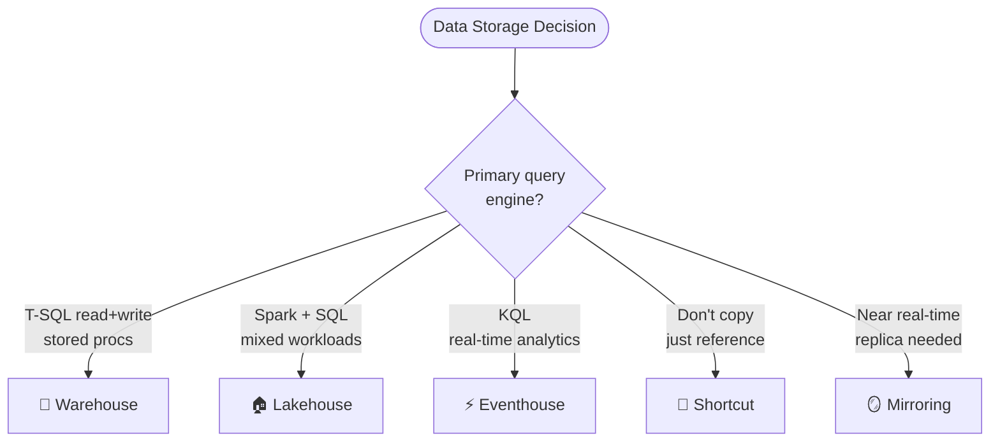
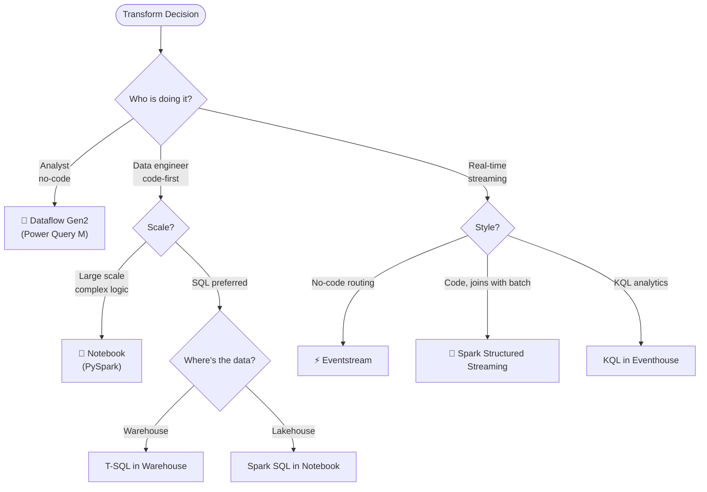
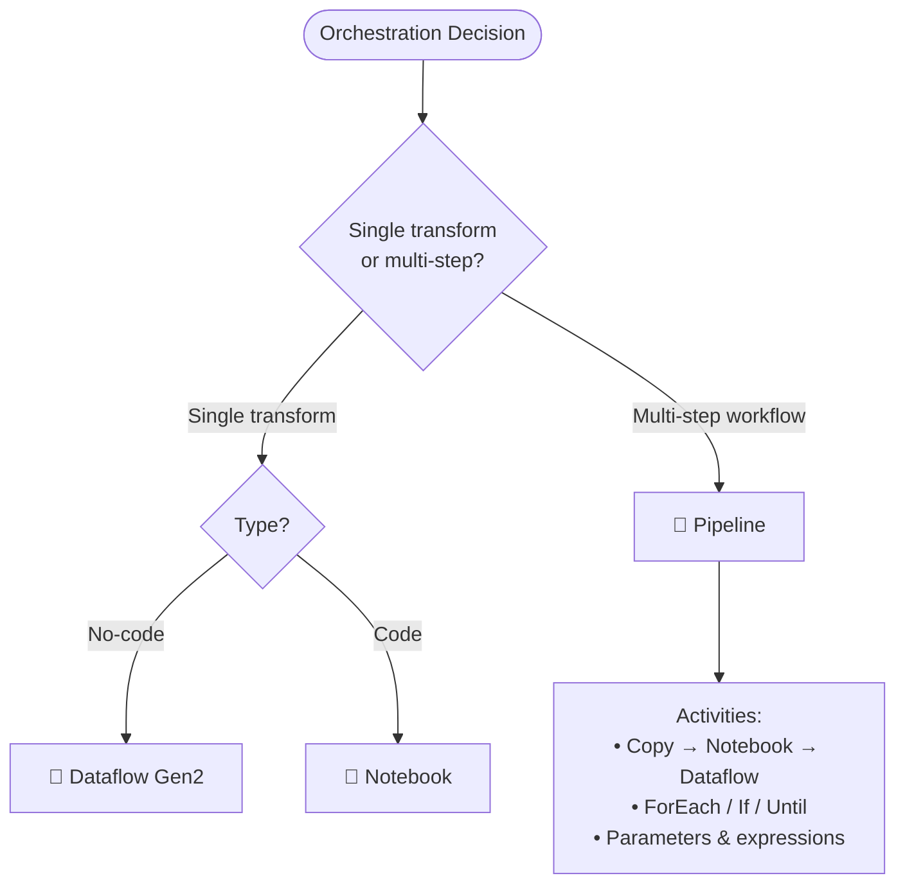
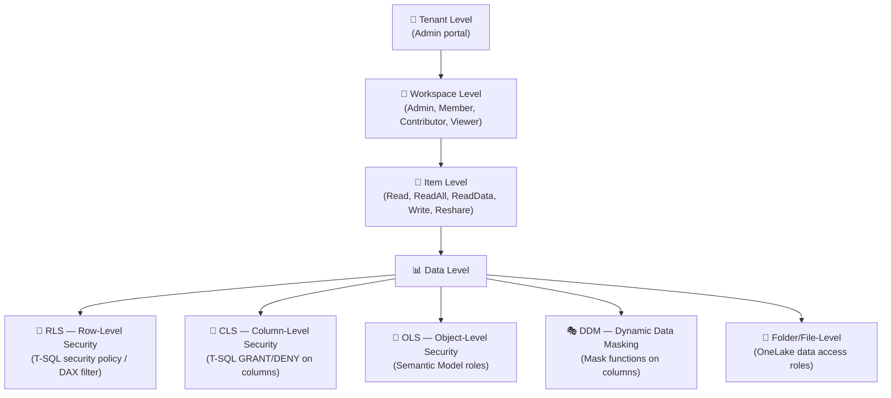

# 04 — Quick Reference Cheatsheet
> 📁 [← Back to Home](/dp-700-study-notes/)

---

## ⚡ Key Numbers to Remember

| Item | Value | Notes |
|------|-------|-------|
| Passing score | **700 / 1000** | Scaled score — not 70% |
| Exam duration | **100 minutes** | 120 min seat time total |
| Domains | **3** | Equally weighted (30–35% each) |
| VACUUM default retention | **7 days** (168 hours) | Shorter retention breaks time travel |
| Delta checkpoint interval | **Every 10 versions** | Transaction log compaction |
| Deployment pipeline stages | **Up to 10** | Typically Dev → Test → Prod |
| Broadcast join limit | **~100 MB** | Larger tables cause OOM |
| Eventhouse hot cache default | **Unlimited** *(policy-configurable)* | Set explicitly for cost control |
| OneLake shortcut sources | **5 types** | OneLake, ADLS Gen2, S3, GCS, Dataverse |

---

## 🧭 Master Decision Trees

### "Where Should I Store This Data?"

### "How Should I Transform This Data?"

### "How Should I Orchestrate This?"

---

## 🔒 Security Layer Reference

| Security Layer | Where Supported | Method |
|---------------|----------------|--------|
| **Workspace roles** | All items | Admin, Member, Contributor, Viewer |
| **Item permissions** | All items | Share dialog / API |
| **RLS** | Warehouse, SQL Endpoint, Semantic Model | T-SQL security policy / DAX |
| **CLS** | Warehouse, SQL Endpoint | T-SQL GRANT/DENY |
| **OLS** | Semantic Model | Model role with `none` permission |
| **DDM** | Warehouse | T-SQL masked column |
| **Folder/file** | Lakehouse | OneLake data access roles |

---

## 🔄 Lakehouse vs Warehouse — Quick Compare

| | Lakehouse | Warehouse |
|-|-----------|-----------|
| **Engine** | Spark (primary) + SQL Endpoint (read-only) | T-SQL (read/write) |
| **Format** | Delta Lake | Delta Lake |
| **Write via SQL** | ❌ No (SQL Endpoint is read-only) | ✅ Yes |
| **Stored procs** | ❌ No | ✅ Yes |
| **Files section** | ✅ Yes (unstructured data) | ❌ No |
| **Cross-DB queries** | Via shortcuts | ✅ Native |
| **Best persona** | Data engineer, data scientist | SQL analyst, BI developer |

---

## 📦 Delta Lake Operations Cheatsheet

| Operation | Purpose | Command |
|-----------|---------|---------|
| **OPTIMIZE** | Compact small files | `OPTIMIZE table_name` |
| **Z-ORDER** | Co-locate data by columns | `OPTIMIZE table_name ZORDER BY (col)` |
| **VACUUM** | Remove old files | `VACUUM table_name RETAIN 168 HOURS` |
| **V-Order** | Columnar read optimization | Enabled by default in Fabric |
| **MERGE** | Upsert (insert/update) | Delta `MERGE INTO ... WHEN MATCHED ... WHEN NOT MATCHED` |
| **Time Travel** | Query past versions | `SELECT * FROM table VERSION AS OF 5` |
| **Schema Evolution** | Add columns on write | `.option("mergeSchema", "true")` |
| **Change Data Feed** | Stream changes from Delta | `.option("readChangeFeed", "true")` |

---

## ⚡ Spark Performance Cheatsheet

| Problem | Solution |
|---------|----------|
| Slow join (small + large table) | **Broadcast join** — `broadcast(small_df)` |
| Data skew in join/group | **Salt keys** or rely on **AQE** (auto) |
| Too many small output files | **`coalesce(n)`** before write |
| Too many shuffle partitions | AQE auto-coalesces; or set `spark.sql.shuffle.partitions` |
| Slow scan on filtered column | **Z-ORDER** on that column |
| General read perf | **V-Order** (default) + **OPTIMIZE** |
| Repeated intermediate use | **`df.cache()`** or **`df.persist()`** |
| Slow UDFs | Replace with **built-in PySpark functions** |
| Cold start delay | **Starter pools** (pre-warmed) |
| Need 4x faster on supported ops | **Native execution engine** |

---

## 🌊 Streaming Quick Reference

| Feature | Eventstream | Spark Structured Streaming | KQL |
|---------|-------------|---------------------------|-----|
| **Code** | No-code | PySpark | KQL |
| **Latency** | Seconds | Seconds–min | Seconds |
| **Windowing** | Basic | Full | Full |
| **Joins with batch** | Limited | ✅ Full | ✅ Via shortcuts/materialized views |
| **Destination** | Eventhouse, Lakehouse, Warehouse | Lakehouse (Delta) | KQL Database |
| **Best for** | Routing, simple transforms | Complex transforms, ML | Real-time analytics, dashboards |

---

## 🚨 Top Exam Traps

1. **Lakehouse SQL Endpoint is READ-ONLY** — you cannot INSERT/UPDATE/DELETE via T-SQL on a Lakehouse. Use Warehouse for that.

2. **OPTIMIZE ≠ VACUUM** — OPTIMIZE compacts files; VACUUM deletes old files. They solve different problems.

3. **VACUUM retention < 7 days breaks time travel** — the default 168 hours exists for a reason.

4. **V-Order is NOT Z-Order** — V-Order optimizes within files (columnar sorting); Z-Order optimizes across files (data co-location).

5. **Mirroring ≠ Shortcuts** — Mirroring copies data (CDC-based); shortcuts point to data without copying.

6. **Git syncs definitions, NOT data** — Git integration version-controls item metadata, not the actual data in tables.

7. **Deployment pipelines deploy definitions, NOT data** — same as Git — item definitions are promoted, not data.

8. **DDM is not a security boundary** — users with UNMASK permission see the real data. Don't rely on DDM for sensitive access control.

9. **Workspace Viewer ≠ data access** — Viewer role lets you see items but may not grant access to the underlying data.

10. **Dataflow Gen2 memory issues → enable staging** — when Dataflow Gen2 runs out of memory, configure a staging Lakehouse.

11. **AQE is enabled by default** — don't manually tune what AQE handles automatically (skew joins, partition coalescing).

12. **Broadcast join OOM** — if the "small" table is > ~100MB, broadcast will fail. Check size first.

13. **Shortcut data is NOT affected by OPTIMIZE/VACUUM** — only native Lakehouse data is optimized.

14. **KQL query acceleration on shortcuts adds CU cost** — it caches data for performance but consumes additional capacity.

---

## 📋 Pre-Exam Checklist

- [ ] **Lakehouse vs Warehouse** — Can you explain when to use each and the SQL Endpoint limitation?
- [ ] **Loading patterns** — Full load, incremental (watermark, CDC), MERGE for upserts?
- [ ] **Security layers** — Workspace, item, RLS, CLS, OLS, DDM, folder/file-level?
- [ ] **Orchestration** — Pipeline vs Dataflow Gen2 vs Notebook — when to use which?
- [ ] **Delta Lake** — OPTIMIZE, VACUUM, Z-ORDER, V-Order, MERGE, time travel?
- [ ] **Spark optimization** — Broadcast joins, AQE, coalesce, predicate pushdown, caching?
- [ ] **Streaming** — Eventstream vs Spark Structured Streaming vs KQL, windowing types?
- [ ] **Mirroring vs Shortcuts** — Copy vs point, CDC vs reference, latency trade-offs?
- [ ] **Lifecycle management** — Git integration, deployment pipelines, database projects?
- [ ] **Monitoring** — Monitoring Hub, Spark UI tabs, DMVs, query insights?
- [ ] **Error resolution** — Common errors in pipelines, notebooks, Dataflow Gen2, T-SQL?
- [ ] **KQL basics** — `summarize`, `bin()`, `ago()`, materialized views, caching policy?

---

## 📊 Full Scenario Decision Table

| Scenario | Key Constraint | Answer |
|----------|---------------|--------|
| SQL analysts write stored procedures | T-SQL read/write | **Warehouse** |
| Data engineers use PySpark + SQL | Mixed engine | **Lakehouse** |
| Access ADLS Gen2 without copying | No data movement | **OneLake Shortcut** |
| Near real-time replica of Azure SQL | Automatic CDC | **Mirroring** |
| No-code CSV-to-table transform | Citizen developer | **Dataflow Gen2** |
| Complex PySpark ETL on 500M rows | Code-first, large scale | **Notebook** |
| Multi-step: Copy → Transform → Refresh | Orchestration | **Data Pipeline** |
| Real-time IoT event routing | Stream processing | **Eventstream → Eventhouse** |
| 5-min tumbling window aggregation | Time-series | **KQL `bin()` or Spark `window()`** |
| Upsert changed rows into Delta | Incremental load | **Delta MERGE** |
| Compact small files for read perf | File management | **OPTIMIZE** |
| Remove old unreferenced files | Storage cleanup | **VACUUM** |
| Speed up filtered queries | Query optimization | **Z-ORDER BY** |
| Restrict rows by user's region | Data security | **RLS (T-SQL security policy)** |
| Hide column from specific users | Column security | **CLS (T-SQL GRANT/DENY)** |
| Mask email in query output | Data masking | **DDM** |
| Promote Dev → Test → Prod | CI/CD | **Deployment Pipelines** |
| Version-control notebooks | Source control | **Git Integration** |
| Slow Dataflow Gen2, OOM | Memory issue | **Enable staging Lakehouse** |
| Spark join slow, small + large table | Join optimization | **Broadcast join** |
| Too many small output files | Write optimization | **coalesce() before write** |
| Slow KQL on historical data | Cache miss | **Extend caching policy / query acceleration** |
