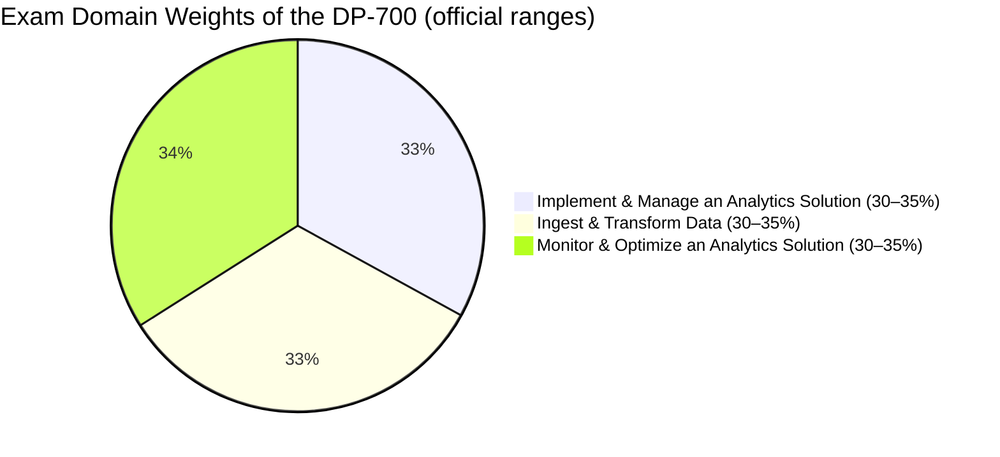
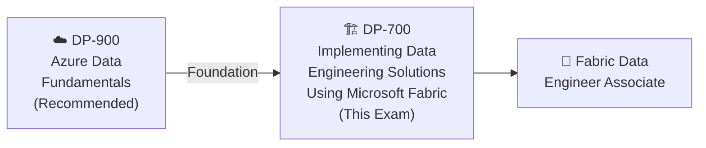

# 📘 DP-700: Implementing Data Engineering Solutions Using Microsoft Fabric
### Study Notes Repository

[](https://github.com/marcogrimaldi29/dp-700-study-notes/actions/workflows/pages.yml)
[](https://github.com/marcogrimaldi29/dp-700-study-notes)
[](https://marcogrimaldi29.com)

> - 🎯 **Goal:** Earn the Microsoft Certified: Fabric Data Engineer Associate badge
> - 📅 **Notes Version:** 2026
> - 🌐 **Published site:** [📘 DP-700 Study Notes](https://marcogrimaldi29.com/dp-700-study-notes/)
> - ✍️ **Author:** [Marco Grimaldi](https://www.linkedin.com/in/marco-grimaldi29/)
> - 🔗 **Related repos:** [📘 AZ-305 Study Notes](https://marcogrimaldi29.com/az-305-study-notes/)
---

## 📋 Exam At-a-Glance

| Detail | Info |
|--------|------|
| 🏅 Certification | Microsoft Certified: Fabric Data Engineer Associate |
| 📝 Passing Score | **700 / 1000** |
| 💶 Exam Price | **~€126 EUR** *(varies by country; VAT may apply)* |
| ⏱️ Duration | **100 minutes** *(120 min seat time incl. check-in)* |
| ❓ Question Types | MCQ, multi-select, drag-and-drop, case studies |
| 🔁 Renewal | **Annual** via free online assessment on Microsoft Learn |
| 🛡️ Prerequisite | **None** *(recommended: hands-on Fabric experience)* |

---

## 📊 Official Domain Breakdown

> ⚠️ **Official ranges** from the Microsoft study guide (updated April 2026)



| # | Domain | Official Weight | Key Services |
|---|--------|----------------|-------------|
| 1 | Implement & Manage an Analytics Solution | **30–35%** | Workspaces, deployment pipelines, security, governance, orchestration |
| 2 | Ingest & Transform Data | **30–35%** | Lakehouses, warehouses, Dataflow Gen2, notebooks, Eventstreams, KQL |
| 3 | Monitor & Optimize an Analytics Solution | **30–35%** | Monitoring Hub, Spark optimization, query tuning, error resolution |

> 🔑 **All three domains are equally weighted** — balanced study across all areas is critical.

---

## 🗺 Certification Path



---

## 🗂️ Repository Structure

```
dp-700-study-notes/
├── README.md                                    ← 📍 You are here
├── 00-fabric-prerequisites.md                   ← Microsoft Fabric fundamentals
├── 01-implement-manage-analytics-solution.md    ← Domain 1 (30–35%)
├── 02-ingest-transform-data.md                  ← Domain 2 (30–35%)
├── 03-monitor-optimize-analytics-solution.md    ← Domain 3 (30–35%)
└── 04-quick-reference-cheatsheet.md             ← Last-minute review & exam traps
```

---

## 📚 Official Learning Resources

| Resource | Link |
|----------|------|
| 📚 Microsoft's DP-700 Certification Learning Paths | [Certification Learning Paths](https://learn.microsoft.com/en-us/credentials/certifications/fabric-data-engineer-associate/) |
| 📄 Official Exam Page | [DP-700 Exam](https://learn.microsoft.com/en-us/credentials/certifications/exams/dp-700/) |
| 📋 Skills Measured / Study Guide | [Official Study Guide](https://learn.microsoft.com/en-us/credentials/certifications/resources/study-guides/dp-700) |
| 🧪 Free Practice Assessment | [Practice Assessment](https://learn.microsoft.com/en-us/credentials/certifications/exams/dp-700/practice/assessment?assessment-type=practice&assessmentId=90) |
| 🎬 Exam Readiness Videos | [Exam Readiness Zone](https://learn.microsoft.com/en-us/shows/exam-readiness-zone/) |
| 📚 Microsoft Fabric Documentation | [Fabric Docs](https://learn.microsoft.com/en-us/fabric/) |
| 🎓 Instructor-Led Course | [DP-700T00-A (4 days)](https://learn.microsoft.com/en-us/training/courses/dp-700t00) |
| 💶 EU Exam Pricing | [Pearson VUE Microsoft](https://home.pearsonvue.com/microsoft) |

---

### ✅ Key Study Tips

- 🎯 The exam tests **"which Fabric component?"** not just **"what does it do?"** — think in trade-offs and constraints
- 🔄 Know **Dataflow Gen2 vs Notebook vs Pipeline** boundaries — the exam tests which tool fits which scenario
- 🔒 Study **security layers deeply** — workspace, item, row, column, object, and folder-level access controls
- 📊 **Streaming vs batch** decision trees appear frequently — know Eventstreams, Spark Structured Streaming, and KQL
- 🧊 Know **Lakehouse vs Warehouse** differences — Delta Lake, T-SQL, and when to use each
- ⚡ Anchor every answer to the **data engineering best practices** — incremental loads, partitioning, V-Order
- 📖 For case studies: read **business requirements and constraints first**, then eliminate answers

---

## ⚡ Quick Navigation

| File | Topics Covered |
|------|---------------|
| [📘 00 — Fabric Prerequisites](./00-fabric-prerequisites.md) | OneLake, workspaces, lakehouses, warehouses, capacities, Delta Lake |
| [⚙️ 01 — Implement & Manage](./01-implement-manage-analytics-solution.md) | Workspace settings, deployment pipelines, security, governance, orchestration |
| [🔄 02 — Ingest & Transform](./02-ingest-transform-data.md) | Loading patterns, batch/streaming ingestion, PySpark, SQL, KQL, shortcuts |
| [📈 03 — Monitor & Optimize](./03-monitor-optimize-analytics-solution.md) | Monitoring, error resolution, Spark tuning, query optimization |
| [⚡ 04 — Quick Reference Cheatsheet](./04-quick-reference-cheatsheet.md) | Key numbers, decision tables, exam traps, final checklist |

---

## 📚 About the Study Notes

These notes are hosted on **GitHub Pages** and published as a searchable website on this URL:

👉 **[📘 DP-700 Study Notes](https://marcogrimaldi29.com/dp-700-study-notes/)**

The site includes full-text search, Mermaid diagram rendering, and mobile-friendly navigation for on-the-go review.

These notes are designed to be a structured, exam-focused summary of the most important concepts and services based on the official [Microsoft DP-700 Study Guide](https://learn.microsoft.com/en-us/credentials/certifications/resources/study-guides/dp-700) and its criteria.

Additional resources and study notes maintained by me, such as the **[📘 AZ-305 Study Notes](https://marcogrimaldi29.com/az-305-study-notes/)** and more, are also available for those pursuing the Microsoft and Azure certifications at the following Landing Page:

👉 **[🧑‍🏫 Microsoft Study Notes: Central Hub](https://marcogrimaldi29.com/microsoft-study-notes/)**

---

## ✍️ About the Author

Maintained by **[Marco Grimaldi](https://www.linkedin.com/in/marco-grimaldi29/)** — Cloud Consultant, Language Trainer & Lifelong Learner.

🏠 Find more certification guides, study tips, and tech content at **[🌐 marcogrimaldi29.com](https://marcogrimaldi29.com)**

The site is continuously updated and based on my personal study notes and experiences. If you have any feedback, suggestions, or corrections, feel free to [reach out](https://marcogrimaldi29.com/contact/)!

---

## 📈 Analytics

This site uses [Umami](https://umami.is/) for privacy-friendly analytics.

---

## ©️ Credits & Acknowledgements

The [Just the Docs](https://github.com/just-the-docs/just-the-docs) theme is used for a clean, documentation-style layout. Licensed under [MIT](https://opensource.org/license/MIT).

Created with the help of AI. Model used: [Claude Opus 4.6](https://www.anthropic.com/news/claude-opus-4-6). The content has been reviewed and edited by the author for accuracy and clarity, but may contain errors. Always verify against the latest [Microsoft documentation](https://learn.microsoft.com/en-us/fabric/).

> *Not affiliated with or endorsed by Microsoft.*

---
