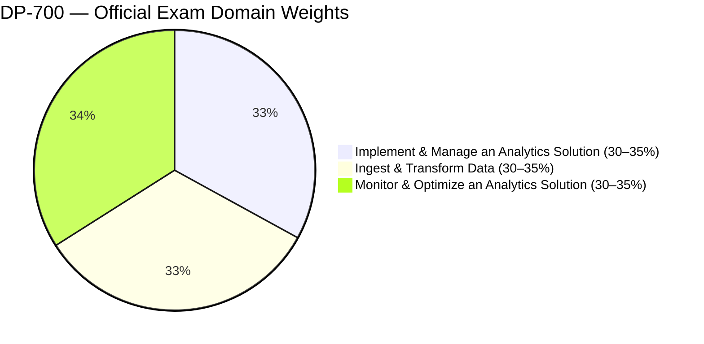
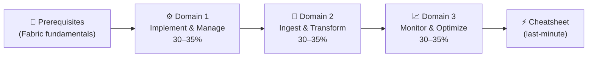

# 📘 DP-700 Study Notes
{: .no_toc }

**Microsoft Fabric Data Engineer Associate**
{: .fs-5 .fw-300 }

[Start Studying →](/dp-700-study-notes/00-fabric-prerequisites){: .btn .btn-primary .fs-5 .mb-4 .mb-md-0 .mr-2 }
[View on GitHub](https://github.com/marcogrimaldi29/dp-700-study-notes){: .btn .fs-5 .mb-4 .mb-md-0 target="_blank" }

---

> 🏠 These notes are maintained by **[Marco Grimaldi](https://www.linkedin.com/in/marco-grimaldi29/)** and based on the **[official Microsoft documentation](https://learn.microsoft.com/en-us/credentials/certifications/fabric-data-engineer-associate/)**.
> Find more certification guides, study tips, and tech content at **[🌐 marcogrimaldi29.com](https://marcogrimaldi29.com)**.
> *Not affiliated with or endorsed by Microsoft. Always verify against the latest Microsoft documentation.*

---

## 🎯 Exam Overview

| Detail | Value |
|--------|-------|
| 🏅 Certification | **Microsoft Certified: Fabric Data Engineer Associate** |
| 📝 Passing Score | **700 / 1000** |
| 💶 Price | ***~€126 EUR** *(varies by country, VAT may apply)* |
| ⏱️ Duration | **100 minutes** *(120 min seat time incl. check-in)* |
| ❓ Question Types | MCQ, multi-select, drag-and-drop, case studies |
| 🔁 Renewal | **Annual** — free online assessment on Microsoft Learn |
| 🛡️ Prerequisite | **None** *(recommended: experience with Microsoft Fabric)* |
| 📚 Languages | English, Japanese, Chinese (Simplified), German, French, Spanish, Portuguese (Brazil) |

---

## 📊 Domain Weights

| # | Domain | Weight | Key Focus Areas |
|---|--------|--------|----------------|
| 1 | [Implement & Manage an Analytics Solution](./01-implement-manage-analytics-solution/) | **30–35%** | Workspace settings, lifecycle management, security & governance, orchestration |
| 2 | [Ingest & Transform Data](./02-ingest-transform-data/) | **30–35%** | Loading patterns, batch ingestion, PySpark/SQL/KQL transforms, streaming |
| 3 | [Monitor & Optimize an Analytics Solution](./03-monitor-optimize-analytics-solution/) | **30–35%** | Monitoring items, error resolution, performance optimization |

---

## 🗂️ Notes Index

<h3 style="margin-top:0;">📘 Prerequisites</h3>

Microsoft Fabric architecture: OneLake, workspaces, lakehouses, warehouses, capacities, and core data engineering concepts.

<a href="./00-fabric-prerequisites/" class="btn btn-outline fs-5">Read →</a>

<h3 style="margin-top:0;">⚙️ Domain 1 — Implement & Manage</h3>

<strong>30–35%</strong> of exam. Workspace settings, deployment pipelines, version control, security, governance, orchestration.

<a href="./01-implement-manage-analytics-solution/" class="btn btn-outline fs-5">Read →</a>

<h3 style="margin-top:0;">🔄 Domain 2 — Ingest & Transform</h3>

<strong>30–35%</strong> of exam. Loading patterns, batch & streaming ingestion, PySpark, SQL, KQL, shortcuts, mirroring.

<a href="./02-ingest-transform-data/" class="btn btn-outline fs-5">Read →</a>

<h3 style="margin-top:0;">📈 Domain 3 — Monitor & Optimize</h3>

<strong>30–35%</strong> of exam. Monitoring ingestion & transformation, error resolution, Spark & query performance optimization.

<a href="./03-monitor-optimize-analytics-solution/" class="btn btn-outline fs-5">Read →</a>

<h3 style="margin-top:0;">⚡ Quick Reference Cheatsheet</h3>

Key numbers, decision matrices, service comparisons, exam traps, and pre-exam checklist.

<a href="./04-quick-reference-cheatsheet/" class="btn btn-outline fs-5">Read →</a>

---

## 🧠 How to Use These Notes

These notes are structured to follow the **official DP-700 study guide** domain order. The recommended reading flow:

### 💡 Study Tips

- 🎯 The exam tests **"which Fabric component?"** — think in trade-offs between Dataflow Gen2, notebooks, pipelines, and KQL
- 🔒 Know **security layers** — workspace, item, row, column, object, and folder-level access controls
- 📊 **Streaming vs batch** patterns appear frequently — know when to use Eventstreams vs Spark Structured Streaming vs KQL
- ⚠️ Each section has **`Exam Caveats`** callouts — these are high-frequency exam traps
- 🔄 Each domain ends with a **quick-reference scenario table** — great for final review

---

## 📄 Official Resources

| Resource | Link |
|----------|------|
| 🎓 Microsoft Certification Path | [Fabric Data Engineer Associate](https://learn.microsoft.com/en-us/credentials/certifications/fabric-data-engineer-associate/) |
| 📋 Skills Measured Guide | [Official Study Guide](https://learn.microsoft.com/en-us/credentials/certifications/resources/study-guides/dp-700) |
| 🧪 Free Practice Assessment | [Practice Test](https://learn.microsoft.com/en-us/credentials/certifications/exams/dp-700/practice/assessment?assessment-type=practice&assessmentId=90) |
| 📚 Microsoft Fabric Documentation | [Fabric Docs](https://learn.microsoft.com/en-us/fabric/) |
| 🎬 Exam Readiness Videos | [Exam Readiness Zone](https://learn.microsoft.com/en-us/shows/exam-readiness-zone/) |
| 💶 EU Exam Booking | [Pearson VUE Microsoft](https://home.pearsonvue.com/microsoft) |

---

## 📚 About the Study Notes

These notes are hosted on **GitHub Pages** and published as a searchable website on this URL:

👉 **[📘 DP-700 Study Notes](https://marcogrimaldi29.com/dp-700-study-notes/)**

The site includes full-text search, Mermaid diagram rendering, and mobile-friendly navigation for on-the-go review.

These notes are designed to be a structured, exam-focused summary of the most important concepts and services based on the official **[Microsoft DP-700 Study Guide](https://learn.microsoft.com/en-us/credentials/certifications/resources/study-guides/dp-700)** and its criteria.

Additional resources and study notes maintained by me, such as the **[📘 AZ-305 Study Notes](https://marcogrimaldi29.com/az-305-study-notes/)** and more, are also available for those pursuing the Microsoft and Azure certifications at the following Landing Page:

👉 **[🧑‍🏫 Microsoft Study Notes: Central Hub](https://marcogrimaldi29.com/microsoft-study-notes/)**

---

## ✍️ About the Author

These notes are maintained by **[Marco Grimaldi](https://www.linkedin.com/in/marco-grimaldi29/)** — Cloud Consultant, Language Trainer & Lifelong Learner.

📍 **Find more content at [🌐 marcogrimaldi29.com](https://marcogrimaldi29.com)**

> The website is continuously updated and based on my personal study notes and experiences. If you have any feedback, suggestions, or corrections, feel free to [reach out](https://marcogrimaldi29.com/contact/)**!

---

## 📈 Analytics

This site uses [Umami](https://umami.is/) for privacy-friendly analytics.

---

## ©️ Credits & Acknowledgements

The [Just the Docs](https://github.com/just-the-docs/just-the-docs) theme is used for a clean, documentation-style layout. Licensed under [MIT](https://opensource.org/license/MIT).

Created with the help of AI. Model used: [Claude Opus 4.6](https://www.anthropic.com/news/claude-opus-4-6). The content has been reviewed and edited by the author for accuracy and clarity, but may contain errors. Always verify against the latest [Microsoft documentation](https://learn.microsoft.com/en-us/fabric/).

> *Not affiliated with or endorsed by Microsoft.*
